.. meta::
   :description: Reference materials for cluster and associated network builds
   :keywords: network validation, cluster, cluster design, cluster architecture, cluster network

************************************************************************************************************************
Cluster architecture and network design for AMD Instinct MI3XX accelerators
************************************************************************************************************************

This document provides a common reference for designing GPU cluster networks using AMD Instinct MI300X, MI325X, MI350X,
and MI355X series accelerators, supporting up to 8192 GPUs. It covers fundamental cluster design principles, network
topologies, scalable architectures, and bill of materials for large-scale deployments. Also included are practical
examples, diagrams, and recommendations for both fat tree and rail network designs, as well as guidance on scaling,
hardware selection, and best practices for high-performance AI/ML workloads. The audience for this content encompasses
architects, engineers, and IT professionals.

Common cluster design principles
========================================================================================================================

Fat tree network topologies
------------------------------------------------------------------------------------------------------------------------

The canonical fat tree topology is a network concept where a switch's connection to upstream peers has at least parity
bandwidth with the total aggregate bandwidth of its downstream connections. This causes links between switches to become
"fatter" as they get closer to the core.

The "fat tree" topology for AI/ML clusters instead refers to how a host is connected to its upstream switches; in this
case all host NICs terminate on the same switch. It can also be considered 1-rail network. The network itself is
generally a 3-stage or 5-stage folded Clos network due to the fixed radix of network switches.

Rail network topologies
------------------------------------------------------------------------------------------------------------------------

Rail networks leverage the same folded Clos network as tree networks, but host connections are instead aggregated onto
switches based on NIC rank. These shared ranks are referred to as rails and allow the network to provide preferential
latency for connections which share the same rail. The downside to this design is any traffic which needs to cross
rails/ranks must traverse either the network spine layer, or Infinity Fabric (PXN). 

Comparison between fat tree and rail networks
------------------------------------------------------------------------------------------------------------------------

Rail networks can provide better latency for traffic within the same rail, enabling larger single hop ring domains.
However, traffic that needs to cross rails can experience higher latency, which can be a bottleneck in large clusters
with high cross-rail traffic.

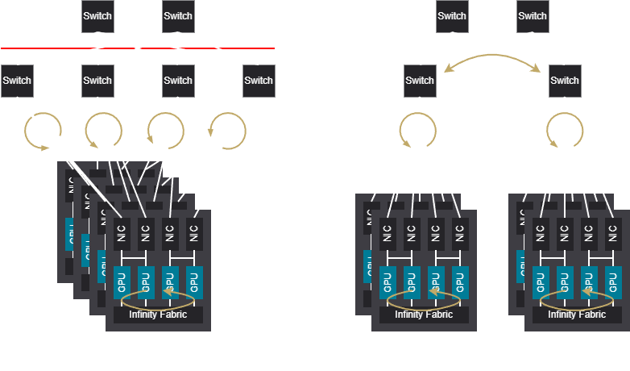

Fat tree networks handle cross-rank traffic better, but may have higher latency for traffic that could have been
contained within a single rail in a rail network.

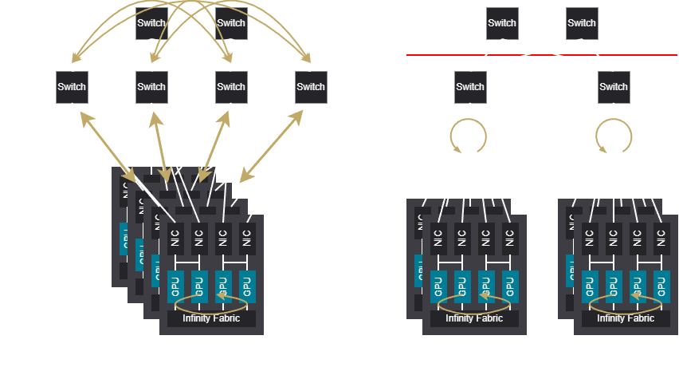

The choice between the two often depends on the specific workload and communication patterns of the applications being
run on the cluster.

Basic network topologies
========================================================================================================================

The following sections describe basic layouts for rail, tree, and hybrid network topologies that can be used as building
blocks for larger cluster designs. These layouts are not exhaustive, but provide a starting point for understanding the
trade-offs between different network architectures.

2-tier rail network
------------------------------------------------------------------------------------------------------------------------

The 2-tier rail network design enables large, scalable unit sizes suitable for large jobs or replica sizes, offering
efficiency for workloads that utilize ring-based collectives, though it also results in higher infrastructure costs due
to the need for additional networking hardware.

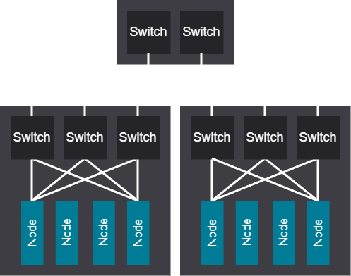

2-tier tree network
------------------------------------------------------------------------------------------------------------------------

The 2-tier tree network design is efficient for small workloads or replicas and can easily scale by adding capacity with
proper planning. It also has the potential to reduce overall infrastructure costs, while its design helps limit the
blast radius compared to rail networks.

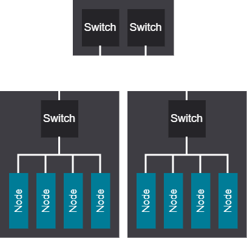

3-tier rail TH5/J3 network
------------------------------------------------------------------------------------------------------------------------

In the 3-tier rail TH5/J3 network design, spine switches are replaced with a two-tier Jericho3-AI/Ramon3 fabric to
enable a larger maximum cluster size, where deeper buffers and scheduled fabric help alleviate congestion in large
clusters with only a small latency trade-off. 

3-tier tree TH5/J3 network
------------------------------------------------------------------------------------------------------------------------

The 3-tier tree TH5/J3 network design provides all the same benefits from switching to a scheduled spine fabric as with
rail, but retains the primary characteristics of tree networks.

3-tier rail optimized network
------------------------------------------------------------------------------------------------------------------------

The 3-tier rail optimized network design allows for massive scalable unit sizes and delivers the best ring-based
collective performance at scale, though this comes with the trade-off of weaker any-to-any communication performance.

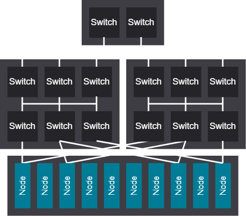

3-tier tree network
------------------------------------------------------------------------------------------------------------------------

The 3-tier tree network design allows for massive cluster sizes and delivers excellent any-to-any performance at scale,
making it well-suited for large deployments that need strong, predictable connectivity. This architecture is
particularly effective for campus-style environments, where broad distribution and high performance are both required.

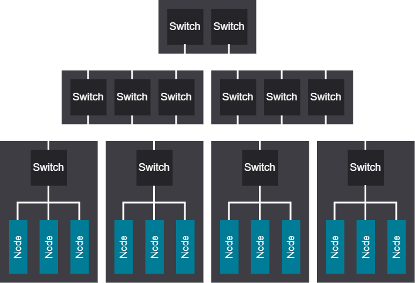

3-tier hybrid rail network
------------------------------------------------------------------------------------------------------------------------

The 3-tier hybrid rail network design allows for massive cluster sizes with large scalable units, favoring ring-based
collectives while still maintaining solid any-to-any performance for large jobs. These characteristics also make it
well-suited for campus-style deployments that balance scalability with broad connectivity requirements.

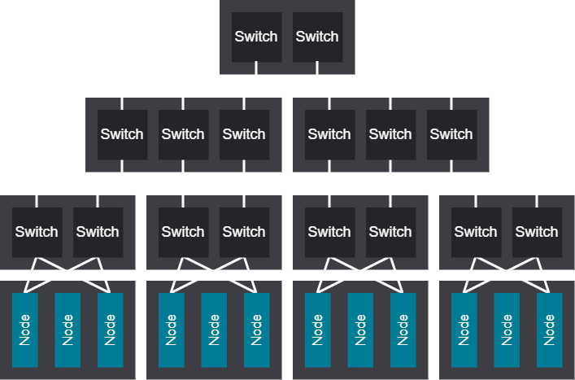

3-tier fully scheduled rail network
------------------------------------------------------------------------------------------------------------------------

The 3-Tier fully scheduled rail network designuses medium-sized scalable units and delivers excellent congestion
performance thanks to deep buffers and scheduled fabric, though technical limitations restrict the recommended cluster
size to roughly 32,000 GPUs.

.. image:: ../data/basic-network-topology-design-examples/3-tier-fully-scheduled-rail-network.png
   :alt: 3-tier fully scheduled rail network diagram

Scaling networks
========================================================================================================================

As cluster size increases, the network must be scaled to accommodate the additional bandwidth and connectivity
requirements. For a 2-tier tree network, spine switches do not need to be added until a second scalable unit is deployed
as all rail/rank traffic occurs at the unit-level. In a 2-tier rail network, spine switches are needed at deployment to
connect rails at any scalable unit number.

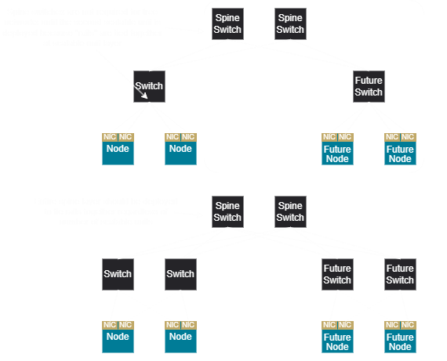

In a 3-tier network, a tree design does not require a super spine until a super-scalable unit is deployed.

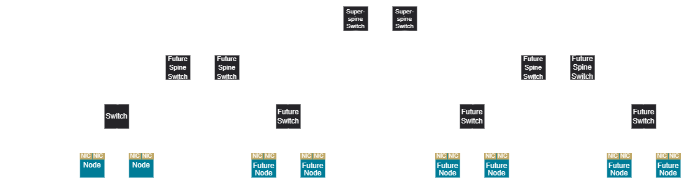

This holds true for hybrid rail as well, where the super spine is only needed at super-scalable unit deployments, but a
fully scheduled rail network requires a super spine from the initial deployment.

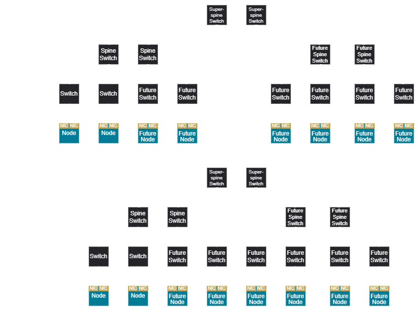

Network subscription
========================================================================================================================

Subscription is the relationship between what is provided by the upstream network and what is required by the downstream
network in demand side. 

It is typically represented as a ratio: 

.. math::

   Downstream Demand : Upstream Capacity

In a 1:1 subscribed network the downstream capacity is equal to the upstream capacity, while in 1:1.16 subscribed
network there is .16 more upstream capacity.

This can also be represented as a percentage: 

.. math::
   
   Subscription Rate =  \frac{Downstream Demand}{Upstream Capacity} 

An 80% subscription ratio could be referred to as "20% undersubscribed", or a 120% subscription ratio could be referred
to as "20% oversubscribed".

Hardware and software components
========================================================================================================================

128 to 1024 GPU generic BOM
------------------------------------------------------------------------------------------------------------------------

The following table provides a generic bill of materials (BOM) for cluster and network designs ranging from 128 to 1024
GPUs. The actual components and quantities may vary based on specific design choices, vendor selection, and scalability
requirements.

**Cluster**

+------------------+-------------------------+ 
| Cluster Size     | 128 to 1024 GPU         |
+==================+=========================+
| Platforms        | Dell XE9680             |
|                  | Lenovo SR685a V3        |
|                  | SMCI AS-8125GS          |
+------------------+-------------------------+
| OS               | Ubuntu 22.04 (or above) |
+------------------+-------------------------+
| Linux kernel     | 5.15 - 6.80             |
+------------------+-------------------------+
| ROCm             | 6.33 (Or above)         |
+------------------+-------------------------+

+------------------+-------------------------+
| Storage Type     |                         |
+==================+=========================+
| Local storage    | 1.6 TB (or greater)     |
+------------------+-------------------------+
| Utility storage  | Pure, Vast, RYO         |
+------------------+-------------------------+
| Bulk storage     | Vast, DDN, WekaIO       |
+------------------+-------------------------+
| Scratch storage  | Vast, DDN, WekaIO,      |
|                  | Hammerspace             |
+------------------+-------------------------+
| Archive/object   | S3 compataible          |
| storage          |                         |
+------------------+-------------------------+

**Network**

+---------------------------+-----------------------------------------------------+
| Backside Network Topology | 2 Tier Rail Optimized / Fat Tree                    |
+===========================+=====================================================+
| NIC                       | Pollara 400, BCM957608 (Thor2)                      |
+---------------------------+-----------------------------------------------------+
|| Switch                   || Arista, Dell, Juniper, Cisco, Nokia                |
||                          || (TH 4/5, Jericho/Ramon)                            |
+---------------------------+-----------------------------------------------------+
| Network OS                | SONiC, Junos, EOS, IOS                              |
+---------------------------+-----------------------------------------------------+
| Subscription ratio        | 1:1.16=16% Undersubscribed (AMD recommended)        |
+---------------------------+-----------------------------------------------------+
| Optics                    | Vendor ACL/HCL transceivers or direct attach copper |
+---------------------------+-----------------------------------------------------+
| Fabric                    | RoCEv2 Ethernet                                     |
+---------------------------+-----------------------------------------------------+

+-----------------------------------------+----------------------------------------------+
| Frontside Network Segement              | Adapter Recommended                          |
+=========================================+==============================================+
| All-in one network                      | Ethernet 100 GbE 2-port QSFP28 adapter       |
+-----------------------------------------+----------------------------------------------+
| Storage network (optional)              | Ethernet 100 GbE 2-port QSFP28 adapter       |
+-----------------------------------------+----------------------------------------------+
| Virtualization network (optional)       | Ethernet 100 GbE 2-port QSFP28 adapter       |
+-----------------------------------------+----------------------------------------------+
| Host in-band                            | Ethernet 10/25GbE 4-Port SFP28 adapter       |
+-----------------------------------------+----------------------------------------------+
| BMC OOB Mgt                             | 1G Copper                                    |
+-----------------------------------------+----------------------------------------------+

1024 to 8192 GPU generic BOM
------------------------------------------------------------------------------------------------------------------------

The following table provides a generic bill of materials for cluster and network designs ranging from 1024 to 8192 GPUs.
The actual components and quantities may vary based on specific design choices, vendor selection, and scalability
requirements.

**Cluster**

+------------------+-------------------------+ 
| Cluster Size     | 1024 to 8192 GPU        |
+==================+=========================+
| Platforms        | Dell XE9680             |
|                  | Lenovo SR685a V3        |
|                  | SMCI AS-8125GS          |
+------------------+-------------------------+
| OS               | Ubuntu 22.04 (or above) |
+------------------+-------------------------+
| Linux kernel     | 5.15 - 6.80             |
+------------------+-------------------------+
| ROCm             | 6.33 (Or above)         |
+------------------+-------------------------+

+------------------+-------------------------+
| Storage Type     |                         |
+==================+=========================+
| Local storage    | 1.6 TB (or greater)     |
+------------------+-------------------------+
| Utility storage  | Pure, Vast, RYO         |
+------------------+-------------------------+
| Bulk storage     | Vast, DDN, WekaIO       |
+------------------+-------------------------+
| Scratch storage  | Vast, DDN, WekaIO,      |
|                  | Hammerspace             |
+------------------+-------------------------+
| Archive/object   | S3 compataible          |
| storage          |                         |
+------------------+-------------------------+

**Network**

+---------------------------+----------------------------------------------+
| Backside Network Topology | 2 Tier Rail Optimized / Fat Tree             |
+===========================+==============================================+
| NIC                       | Pollara 400, BCM957608 (Thor2)               |
+---------------------------+----------------------------------------------+
| Switch                    | Arista, Dell, Juniper, Cisco, Nokia          |
|                           | (TH 4/5, Scheduled Fabrics)                  |
+---------------------------+----------------------------------------------+
| Network OS                | SONiC, Junos, EOS, IOS, DriveNets            |
+---------------------------+----------------------------------------------+
| Subscription ratio        | 1:1.16=16% Undersubscribed (AMD recommended) |
+---------------------------+----------------------------------------------+
| Optics                    | Vendor ACL/HCL                               |
+---------------------------+----------------------------------------------+
| Fabric                    | RoCEv2 Ethernet                              |
+---------------------------+----------------------------------------------+

+-----------------------------------------+----------------------------------------------+
| Frontside Network Segement              | Adapter Recommended                          |
+=========================================+==============================================+
| All-in one network                      | Ethernet 100 GbE 2-port QSFP28 adapter       |
+-----------------------------------------+----------------------------------------------+
| Storage network (optional)              | Ethernet 100 GbE 2-port QSFP28 adapter       |
+-----------------------------------------+----------------------------------------------+
| Virtualization network (optional)       | Ethernet 100 GbE 2-port QSFP28 adapter       |
+-----------------------------------------+----------------------------------------------+
| Host in-band                            | Ethernet 10/25GbE 4-Port SFP28 adapter       |
+-----------------------------------------+----------------------------------------------+
| BMC OOB Mgt                             | 1G Copper                                    |
+-----------------------------------------+----------------------------------------------+

Power requirements
========================================================================================================================

MI355X 
------------------------------------------------------------------------------------------------------------------------

These are design assumptions for a 4MW cluster with 2K MI355X GPUs, including options for 51.2T or scheduled fabrics
switches (Arista, Dell, Juniper, Cisco, Nokia). These assumptions are based on typical power consumption values for the
specified hardware components, and actual power usage may vary based on specific workloads, configurations, and
environmental conditions.

.. note::
   These are estimates only; Please consult with hardware vendor model data sheets for more accurate power 
   specifications.

+------------------------------------------------+----------------------------------------------------+
| **System design**                                                                                   |
+------------------------------------------------+----------------------------------------------------+
| Quantity                                       | 256 MI355X DLC - 2K GPUs                           |
+------------------------------------------------+----------------------------------------------------+
| Average Power per system                       | ≈ 14kW                                             |
+------------------------------------------------+----------------------------------------------------+
| 256 Systems                                    | ≈ 3.584 Megawatts                                  |
+------------------------------------------------+----------------------------------------------------+
| **51.2T switch design**                                                                             |
+------------------------------------------------+----------------------------------------------------+
| Quantity                                       | ≈ 61 switches - 51.2T switch (Dell, Cisco, Arista) |
+------------------------------------------------+----------------------------------------------------+
| Estimated typical/load power per switch        | 540w/1125w ≈ 32.94kW/68.63kW                       |
+------------------------------------------------+----------------------------------------------------+
| **Scheduled fabrics design**                                                                        |
+------------------------------------------------+----------------------------------------------------+
| Quantity                                       | ≈ 10 x 7720R4-128PE & 64 x 7700R4C                 |
+------------------------------------------------+----------------------------------------------------+
| Estimated typical/load power 7720R4-128PE      | 1032w/3848w ≈ 10.32kW/38.48kW                      |
+------------------------------------------------+----------------------------------------------------+
| Estimated typical/load power 7720R4C-38PE      | 593w/1840w ≈ 37.96kW/117.76kW                      |
+------------------------------------------------+----------------------------------------------------+
| Scheduled fabrics estimated power typical/load | ≈ 48.28kW/156.24kW                                 |
+------------------------------------------------+----------------------------------------------------+
| **Storage/Management network design**                                                               |
+------------------------------------------------+----------------------------------------------------+
| Please consult storage and OEM vendors for design and power specifications.                         |
+------------------------------------------------+----------------------------------------------------+

Network design examples
========================================================================================================================

Designs included are based on either Jericho or Ramon switch types (Arista, Ciena, Nokia) or 51.2T switch types (Arista,
Cisco, Dell, Juniper). Vendors and switch models vary for port count and features; please consult your desired vendor's
port count directly to confirm.

The diagrams presented in this section are designed around a scalable unit or POD, which can determine overall network
end to end latency and AI use cases. Certain ML/AI workloads may require a change of scalable unit size. Please consult
with AMD Architecture as required.

128 GPU topology design examples 51.2T
------------------------------------------------------------------------------------------------------------------------

**Single switch design - 8-128 GPU (1-16 nodes)**

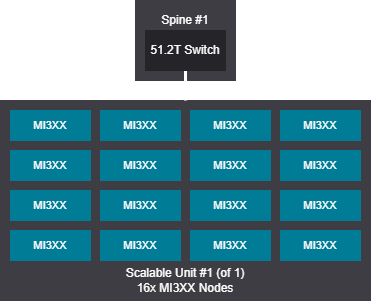

256 - 864 GPU topology design examples scheduled fabrics
------------------------------------------------------------------------------------------------------------------------

**Tree design - 129-256 GPU (17-32 nodes)**

**Rail design - 129-288 GPU (17-36 nodes)**

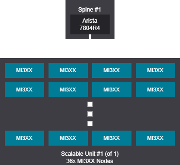

**Tree design - 257-512 GPU (33-64 nodes)**

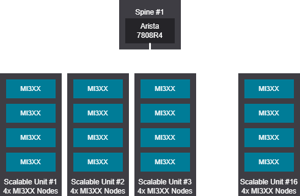

**Rail design - 289-576 GPU (37-72 nodes)**

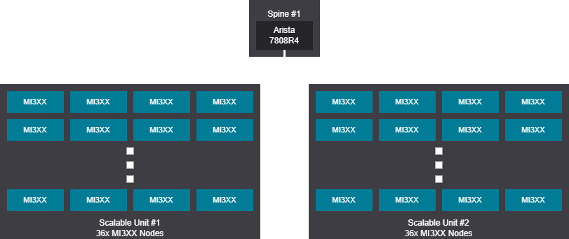

**Tree design - 513-768 GPU (65-96 nodes)**

**Rail design - 577-864 GPU (73-108 nodes)**

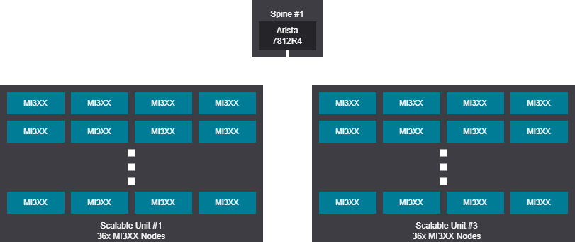

1K GPU topology design examples scheduled fabrics
------------------------------------------------------------------------------------------------------------------------

**Tree design - 128-1024 GPU (16-128 nodes)**

**Rail design - 128-1152 GPU (16-144 nodes)**

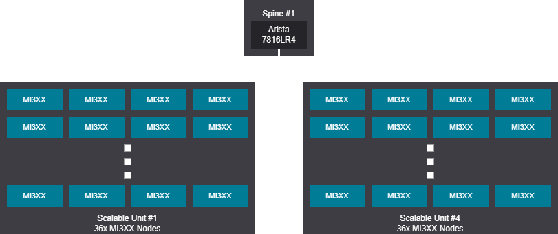

2K GPU topology design examples scheduled fabrics
------------------------------------------------------------------------------------------------------------------------

**Tree design - 2048 GPU (256 Nodes)**

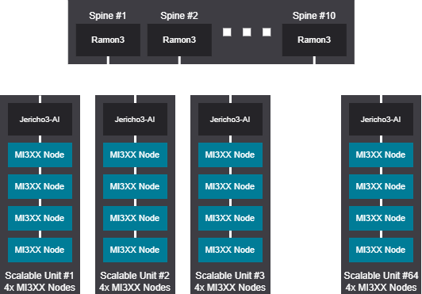

**Tree scalable unit - 2048 GPU (256 Nodes)**

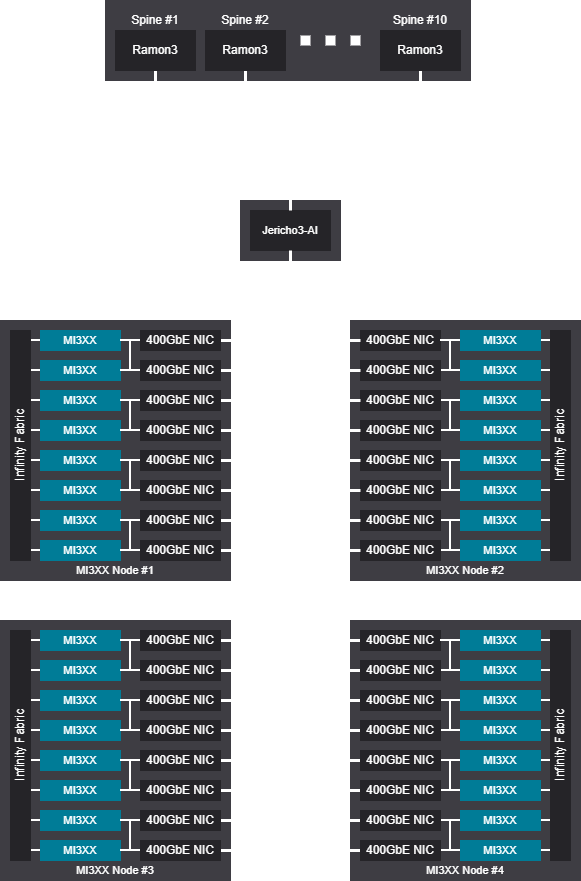

**Rail design - 2048-2304 GPU (256-288 Nodes)**

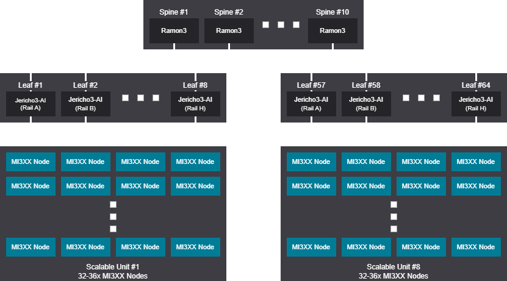

**Rail scalable unit - 2048-2304 GPU (256-288 Nodes)**

2K GPU topology design examples 51.2T
------------------------------------------------------------------------------------------------------------------------

**Tree design - 2072 GPU (259 Nodes)**

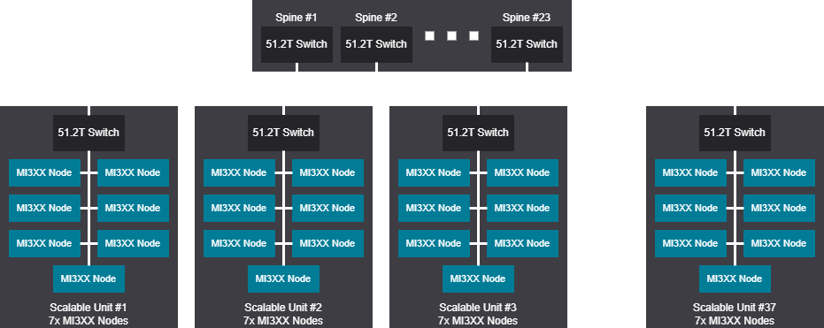

**Tree scalable unit - 2072 GPU (259 Nodes)**

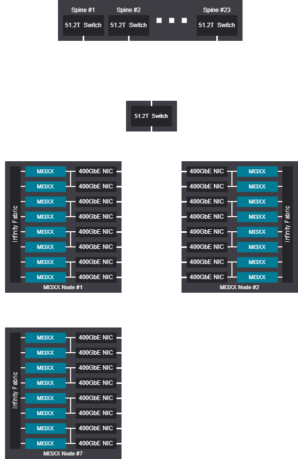

**Rail design - 2080 GPU (260 Nodes)**

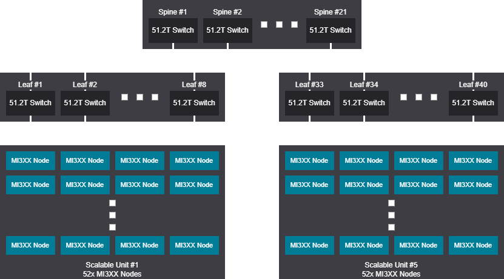

**Rail scalable unit - 2080 GPU (260 Nodes)**

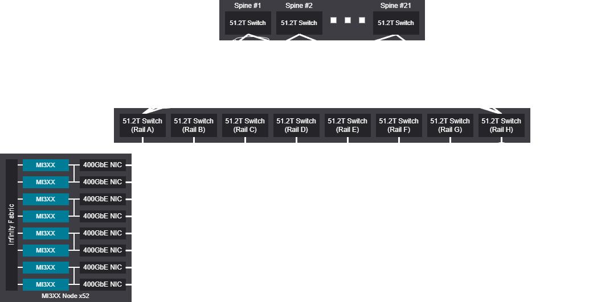

4K GPU topology design examples scheduled fabrics
------------------------------------------------------------------------------------------------------------------------

**Tree design - 4096 GPU (512 Nodes)**

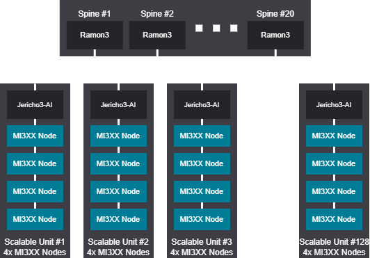

**Tree scalable unit - 4096 GPU (512 Nodes)**

**Rail design - 4096-4608 GPU (512-576 Nodes)**

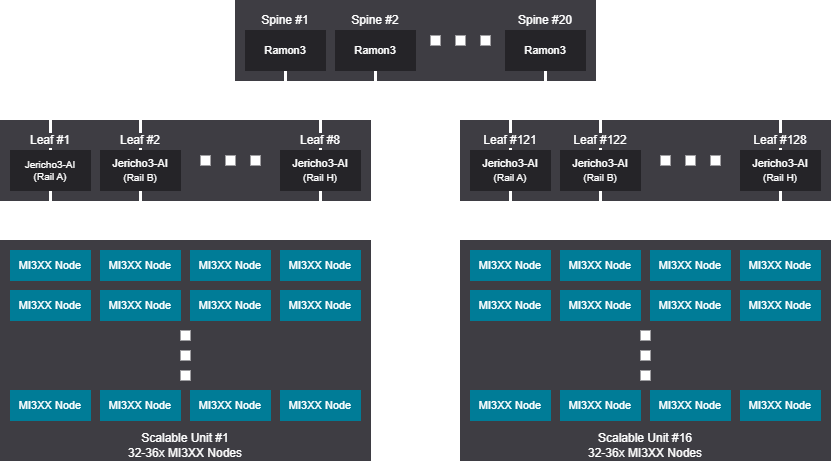

**Rail scalable unit - 4096-4608 GPU (512-576 Nodes)**

4K GPU topology design examples 51.2T
------------------------------------------------------------------------------------------------------------------------

**Tree design - 4144 GPU (518 Nodes)**

**Tree scalable unit - 4144 GPU (518 Nodes)**

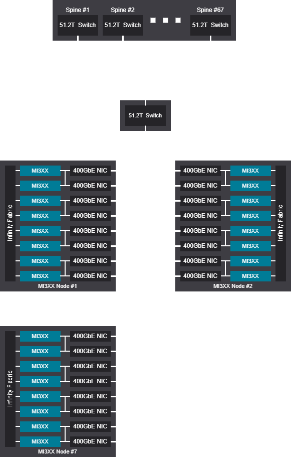

**Rail design - 4104 GPU (513 Nodes)**

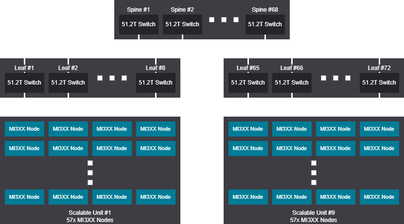

**Rail scalable unit - 4104 GPU (513 Nodes)**

6K GPU topology design examples scheduled fabrics
------------------------------------------------------------------------------------------------------------------------

**Tree design - 6016 GPU (752 Nodes)**

**Tree scalable unit - 6016 GPU (752 Nodes)**

**Rail design - 6144-6912 GPU (768-864 Nodes)**

**Rail scalable unit - 6144-6912 GPU (768-864 Nodes)**

6K GPU topology design examples 51.2T
------------------------------------------------------------------------------------------------------------------------

**Tree design - 6048 GPU (756 Nodes)**

**Tree scalable unit - 6048 GPU (756 Nodes)**

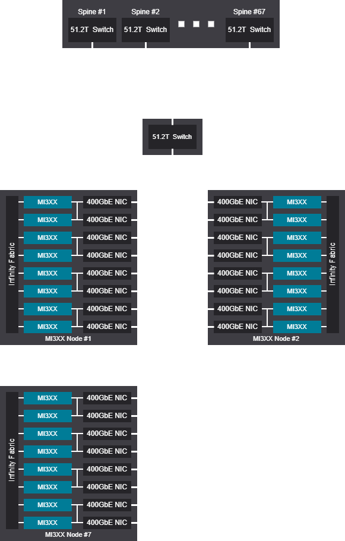

**Rail design - 6032 GPU (754 Nodes)**

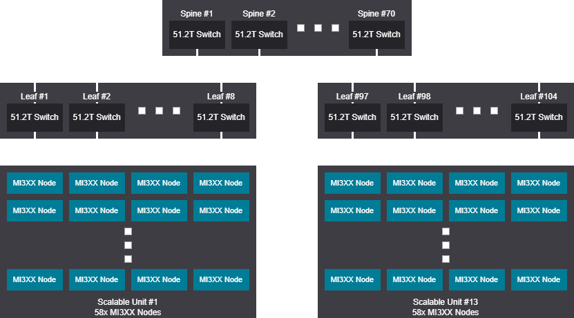

**Rail scalable unit - 6032 GPU (754 Nodes)**

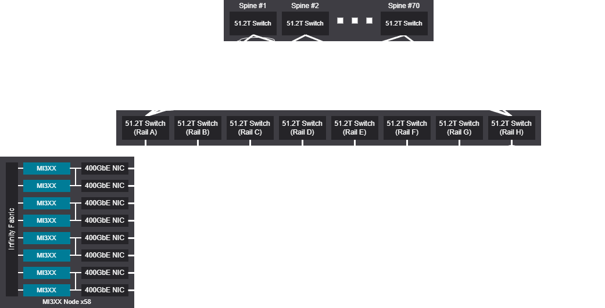

8K GPU topology design examples scheduled fabrics
------------------------------------------------------------------------------------------------------------------------

**Tree design - 8192 GPU (1024 Nodes)**

**Tree scalable unit - 8192 GPU (1024 Nodes)**

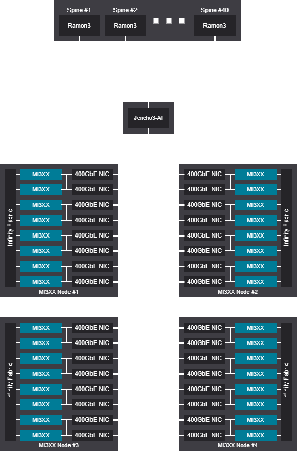

**Rail design - 8192-9216 GPU (1024-1152 Nodes)**

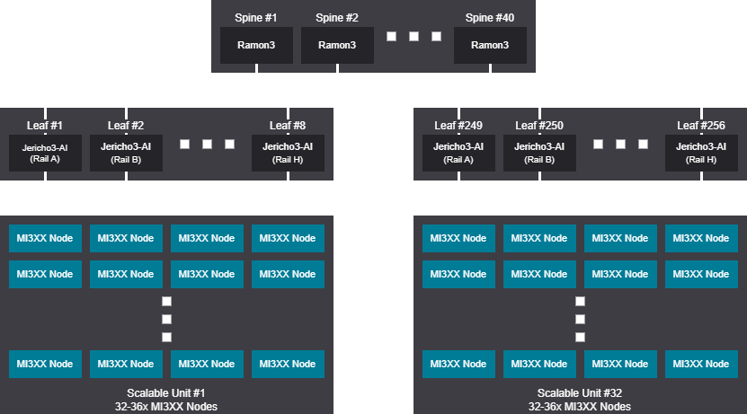

**Rail scalable unit - 8192-9216 GPU (1024-1152 Nodes)**

Legal information
========================================================================================================================

DISCLAIMER

The information contained herein is for informational purposes only, and is subject to change without notice.
While every precaution has been taken in the preparation of this document, it may contain technical inaccuracies,
omissions and typographical errors, and AMD is under no obligation to update or otherwise correct this information.
Advanced Micro Devices, Inc. makes no representations or warranties with respect to the accuracy or completeness of the
contents of this document, and assumes no liability of any kind, including the implied warranties of noninfringement,
merchantability or fitness for particular purposes, with respect to the operation or use of AMD hardware, software or
other products described herein.  No license, including implied or arising by estoppel, to any intellectual property
rights is granted by this document.  Terms and limitations applicable to the purchase or use of AMD's products are as
set forth in a signed agreement between the parties or in AMD's Standard Terms and Conditions of Sale. GD-18 

COMPLIANCE WITH LAWS

Customer shall adhere to all applicable export laws and regulations including, without limitation, those
administered by the U.S. Department of Commerce - Bureau of Industry and Security (U.S. Export Administration
Regulations 15 CFR 730 et seq.) and those administered by the U.S. Department of State in accordance with the U.S.
International Traffic in Arms Regulations (ITAR) set forth in Subchapter M, Title 22, Code of Federal Regulations, Parts
120 through 130 (22 CFR 120-130), as the same may be amended from time to time, and shall not export, re-export, resell,
transfer, or disclose, directly or indirectly, any Products or technical data, or the direct product of any Products or
technical data, to any proscribed person, entity, or country, or foreign national thereof, unless properly authorized by
the U.S. government and/or any other applicable or relevant government or regulatory body, including the export
authorities of all respective countries. For the avoidance of doubt, Customer shall not use Products in, or re-export
Products to Belarus, Russia and the Donetsk (DNR) or Luhansk (LNR) regions of Ukraine, regardless of the applicable
export laws and regulations. Customer shall impose upon its customers terms at least as restrictive as those contained
in this Clause 14 with respect to any sale, distribution or export of Products. 

© 2025 Advanced Micro Devices, Inc. All
rights reserved. AMD, the AMD Arrow logo, AMD Instinct, AMD together we advance\_, Infinity Fabric, ROCm, and
combinations thereof are trademarks of Advanced Micro Devices, Inc. Amazon S3, Arista, Arista OSFP, APC, Broadcom,
Ciena, Cisco, CloudVision, DataDirect Networks, Dell, DriveNets, EOS, FS.com, Hammerspace, Hewlett-Packard Enterprise, IOS,
Juniper, JUNOS, Lenovo, Linux, MTP, Netshelter, Nokia, Proliant, Pure Storage, Schneider Electric, SONiC, Super Micro
Computer Inc, Tomahawk, Ubuntu, Vast Data, Weka, and other product names used in this publication are for identification
purposes only and may be trademarks of their respective owners. Certain AMD technologies may require third-party
enablement or activation. Supported features may vary by operating system. Please confirm with the system manufacturer
for specific features. No technology or product can be completely secure.

