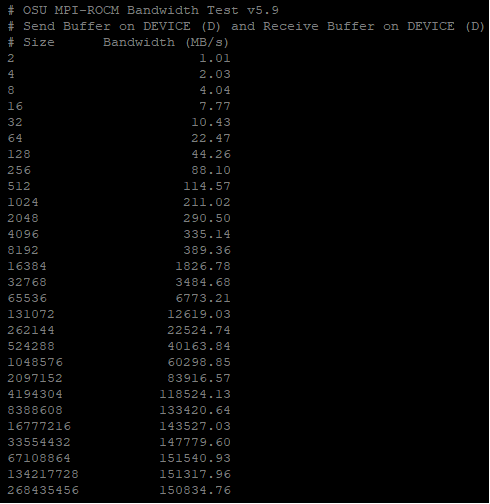

.. meta::
   :description: GPU-enabled Message Passing Interface
   :keywords: Message Passing Interface, MPI, AMD, ROCm

************************************************************************************************************************
GPU-enabled Message Passing Interface
************************************************************************************************************************

The Message Passing Interface (`MPI <https://www.mpi-forum.org>`_) is a standard API for distributed and parallel
application development that can scale to multi-node clusters. To facilitate the porting of applications to clusters
with GPUs, ROCm enables various technologies. You can use these technologies add GPU pointers to MPI calls and enable
ROCm-aware MPI libraries to deliver optimal performance for both intra-node and inter-node GPU-to-GPU communication.

The AMD kernel driver exposes remote direct memory access (RDMA) through *PeerDirect* interfaces. This allows network
interface cards (NICs) to directly read and write to RDMA-capable GPU device memory, resulting in high-speed direct
memory access (DMA) transfers between GPU and NIC. These interfaces are used to optimize inter-node MPI message
communication.

The Open MPI project is an open source implementation of the MPI. It's developed and maintained by a consortium of
academic, research, and industry partners. To compile Open MPI with ROCm support,
refer to the following sections:

* :ref:`open-mpi-ucx`
* :ref:`open-mpi-libfabric`

.. _open-mpi-ucx:

ROCm-aware Open MPI on InfiniBand and RoCE networks using UCX
========================================================================================================================

The `Unified Communication Framework <https://www.openucx.org/documentation>`_ (UCX), is an open source, cross-platform
framework designed to provide a common set of communication interfaces for various network programming models and
interfaces. UCX uses ROCm technologies to implement various network operation primitives. UCX is the standard
communication library for InfiniBand and RDMA over Converged Ethernet (RoCE) network interconnect. To optimize data
transfer operations, many MPI libraries, including Open MPI, can leverage UCX internally.

UCX and Open MPI have a compile option to enable ROCm support. To install and configure UCX to compile Open MPI for
ROCm, use the following instructions.

#. Set environment variables to install all software components in the same base directory. We use the home directory in
   our example, but you can specify a different location if you want.

   .. code-block:: shell
    
      export INSTALL_DIR=$HOME/ompi_for_gpu
      export BUILD_DIR=/tmp/ompi_for_gpu_build
      mkdir -p $BUILD_DIR

#. Install UCX. To view UCX and ROCm version compatibility, refer to the `communication libraries tables
   <https://rocm.docs.amd.com/projects/install-on-linux/en/latest/reference/3rd-party-support-matrix.html>`_

   .. code-block:: shell

      export UCX_DIR=$INSTALL_DIR/ucx
      cd $BUILD_DIR
      git clone https://github.com/openucx/ucx.git -b v1.15.x
      cd ucx
      ./autogen.sh
      mkdir build
      cd build
      ../configure -prefix=$UCX_DIR \
          --with-rocm=/opt/rocm
      make -j $(nproc)
      make -j $(nproc) install

#. Install Open MPI.

   .. code-block:: shell

      export OMPI_DIR=$INSTALL_DIR/ompi
      cd $BUILD_DIR
      git clone --recursive https://github.com/open-mpi/ompi.git \
          -b v5.0.x
      cd ompi
      ./autogen.pl
      mkdir build
      cd build
      ../configure --prefix=$OMPI_DIR --with-ucx=$UCX_DIR \
          --with-rocm=/opt/rocm
      make -j $(nproc)
      make install

.. _rocm-enabled-osu:

ROCm-enabled OSU benchmarks
------------------------------------------------------------------------------------------------------------------------

You can use OSU Micro Benchmarks (OMB) to evaluate the performance of various primitives on ROCm-supported AMD GPUs. The
``--enable-rocm`` option exposes this functionality.

.. code-block:: shell

    export OSU_DIR=$INSTALL_DIR/osu
    cd $BUILD_DIR
    wget http://mvapich.cse.ohio-state.edu/download/mvapich/osu-micro-benchmarks-7.2.tar.gz
    tar xfz osu-micro-benchmarks-7.2.tar.gz
    cd osu-micro-benchmarks-7.2
    ./configure --enable-rocm \
        --with-rocm=/opt/rocm \
        CC=$OMPI_DIR/bin/mpicc CXX=$OMPI_DIR/bin/mpicxx \
        LDFLAGS="-L$OMPI_DIR/lib/ -lmpi -L/opt/rocm/lib/ -lamdhip64 \ CFLAGS="$(hipconfig -C | tr -d '\n') " CXXFLAGS="-std=c++11" \
        $(hipconfig -C) -lamdhip64" CXXFLAGS="-std=c++11"
    make -j $(nproc)

Intra-node run
------------------------------------------------------------------------------------------------------------------------

Before running an Open MPI job, you must set the following environment variables to ensure that you're using the correct
versions of Open MPI and UCX.

.. code-block:: shell

    export LD_LIBRARY_PATH=$OMPI_DIR/lib:$UCX_DIR/lib:/opt/rocm/lib
    export PATH=$OMPI_DIR/bin:$PATH

To run the OSU bandwidth benchmark between the first two GPU devices (``GPU 0`` and ``GPU 1``) inside the same node, use
the following code.

.. code-block:: shell

    $OMPI_DIR/bin/mpirun -np 2 \
    -x UCX_TLS=sm,self,rocm \
    --mca pml ucx \
    ./c/mpi/pt2pt/standard/osu_bw D D

This measures the unidirectional bandwidth from the first device (``GPU 0``) to the second device (``GPU 1``). To select
specific devices, for example ``GPU 2`` and ``GPU 3``, include the following command:

.. code-block:: shell

    export HIP_VISIBLE_DEVICES=2,3

To force using a copy kernel instead of a DMA engine for the data transfer, use the following command:

.. code-block:: shell

    export HSA_ENABLE_SDMA=0

The following output shows the effective transfer bandwidth measured for inter-die data transfer between ``GPU 2`` and
``GPU 3`` on a system with MI250 GPUs. For messages larger than 67 MB, an effective utilization of about 150 GB/sec is
achieved:

Collective operations
------------------------------------------------------------------------------------------------------------------------

Collective operations on GPU buffers are best handled through the Unified Collective Communication (UCC) library
component in Open MPI. To accomplish this, you must configure and compile the UCC library with ROCm support.

.. note::

    You can verify UCC and ROCm version compatibility using the `communication libraries tables
    <https://rocm.docs.amd.com/projects/install-on-linux/en/latest/reference/3rd-party-support-matrix.html>`_

.. code-block:: shell

    export UCC_DIR=$INSTALL_DIR/ucc
    git clone https://github.com/openucx/ucc.git -b v1.2.x
    cd ucc
    ./autogen.sh
    ./configure --with-rocm=/opt/rocm \
                --with-ucx=$UCX_DIR   \
                --prefix=$UCC_DIR
    make -j && make install

    # Configure and compile Open MPI with UCX, UCC, and ROCm support
    cd ompi
    ./configure --with-rocm=/opt/rocm  \
                --with-ucx=$UCX_DIR    \
                --with-ucc=$UCC_DIR
                --prefix=$OMPI_DIR

To use the UCC component with an MPI application, you must set additional parameters:

.. code-block:: shell

    mpirun --mca pml ucx --mca osc ucx \
       --mca coll_ucc_enable 1     \
       --mca coll_ucc_priority 100 -np 64 ./my_mpi_app

.. _open-mpi-libfabric:

ROCm-aware Open MPI using libfabric
========================================================================================================================

For network interconnects that are not covered in the previous category, such as HPE Slingshot, ROCm-aware communication
can often be achieved through the libfabric library. For more information, refer to the `libfabric documentation
<https://github.com/ofiwg/libfabric/wiki>`_.

.. note::

    When using Open MPI v5.0.x with libfabric support, shared memory communication between processes on the same node
    goes through the *ob1/sm* component. This component has fundamental support for GPU memory that is, accomplished by
    using a staging host buffer Consequently, the performance of device-to-device shared memory communication is lower
    than the theoretical peak performance allowed by the GPU-to-GPU interconnect.

#. Install libfabric. Note that libfabric is often pre-installed. To determine if it's already installed, run:

   .. code-block:: shell

      module avail libfabric

   Alternatively, you can download and compile libfabric with ROCm support. Note that not all components required to
   support some networks (e.g., HPE Slingshot) are available in the open source repository. Therefore, using a
   pre-installed libfabric library is strongly recommended over compiling libfabric manually.

   If a pre-compiled libfabric library is available on your system, you can skip the following step.

#. Compile libfabric with ROCm support.

   .. code-block:: shell

      export OFI_DIR=$INSTALL_DIR/ofi
      cd $BUILD_DIR
      git clone https://github.com/ofiwg/libfabric.git -b v1.19.x
      cd libfabric
      ./autogen.sh
      ./configure --prefix=$OFI_DIR   \
                  --with-rocr=/opt/rocm
      make -j $(nproc)
      make install

Installing Open MPI with libfabric support
------------------------------------------------------------------------------------------------------------------------

To build Open MPI with libfabric, use the following code:

.. code-block:: shell

    export OMPI_DIR=$INSTALL_DIR/ompi
    cd $BUILD_DIR
    git clone --recursive https://github.com/open-mpi/ompi.git \
        -b v5.0.x
    cd ompi
    ./autogen.pl
    mkdir build
    cd build
    ../configure --prefix=$OMPI_DIR --with-ofi=$OFI_DIR \
                    --with-rocm=/opt/rocm
    make -j $(nproc)
    make install

ROCm-aware OSU with Open MPI and libfabric
------------------------------------------------------------------------------------------------------------------------

Compiling a ROCm-aware version of OSU benchmarks with Open MPI and libfabric uses the same
process described in :ref:`rocm-enabled-osu`.

To run an OSU benchmark using multiple nodes, use the following code:

.. code-block:: shell

    export LD_LIBRARY_PATH=$OMPI_DIR/lib:$OFI_DIR/lib64:/opt/rocm/lib
    $OMPI_DIR/bin/mpirun --mca pml ob1 --mca btl_ofi_mode 2 -np 2 \
    ./c/mpi/pt2pt/standard/osu_bw D D
