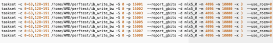

.. meta::
   :description: Learn how to configure multiple nodes for network testing.
   :keywords: network validation, DCGPU, multi node, ROCm, RCCL, machine learning, LLM, usage, tutorial

**************************************************************
Multi-node network configuration for AMD Instinct accelerators
**************************************************************

After single node configuration testing has been completed and verified, validate network connections in node pairs. All the tests described in this topic must be run between two nodes in a client-server relationship. Both nodes
must be configured and verified according to :doc:`./single-node-config`
before running any node-to-node performance tests.

.. _Multinode-Prerequisites:

Prerequisites
=============

Before following the steps in this guide, complete the following prerequisites.

* Install all required software for MPI in the
  :doc:`ROCm documentation <rocm:how-to/gpu-enabled-mpi>`.

  * Specifically, follow the installation instructions for Open MPI, OSU
    benchmarks, and collective operations.

* Install `Slurm Workload Manager <https://slurm.schedmd.com/quickstart_admin.html>`_
  (if applicable). Refer to the
  `Slurm Workload Manager documentation <https://slurm.schedmd.com/documentation.html>`_.

* Implement passwordless SSH.

Evaluate platform-specific BIOS tunings
---------------------------------------

Check your BIOS settings to make sure they are optimized for AMD GPUs. See the
:doc:`AMD Instinct system optimization guides <rocm:how-to/system-optimization/index>`
for more information.

* Enable large bar addressing in the BIOS to support peer to peer GPU memory
  access.

* Verify SR-IOV is enabled, if needed.

* Disable ACS (ACS forces P2P transactions through the PCIe root complex).

.. note::

   If using virtual devices, AER and ACS should be enabled.

Single tier switch configuration
--------------------------------

Take these actions on each single tier (leaf/edge) switch you plan to include in network testing.

#. Configure remote access to the switch management console.

#. Verify the switch sees all hosts and ports are active.

#. For an InfiniBand switch, configure Fabric Manager on the switch or start
   OpenSM on a host in the network if a subnet manager isn't already in place.

#. For an ethernet switch, configure MTU size and priority flow control (PFC)
   and ECN support as needed.

#. Clear all port counters after the switch is ready to use.

.. _OFED-Perftest-installation-and-benchmarking:

OFED perftest installation and benchmarking
============================================

Install and run the `OFED performance tests <https://github.com/linux-rdma/perftest>`_
for host to host (H2H) testing. Loopback is implemented in the tests to remove
the switch from benchmark results. Remember to install OFED perftests on both
nodes you plan to use in this section. Commands may require ``sudo`` depending
on user privileges.

#. From the CLI of your host, clone the perftest repo.

   .. code-block:: shell

      git clone https://github.com/linux-rdma/perftest.git

#. Navigate to the installation directory and build the tests.

   .. code-block:: shell

      cd perftest
      ./autogen.sh
      ./configure --prefix=$PWD/install --enable-rocm --with-rocm=/opt/rocm

#. Locate and open ``Makefile`` in your editor of choice, then append
   ``-D__HIP_PLATFORM_AMD__`` to ``CFLAGS`` and ``CXXFLAGS``. This is required
   to compile the code correctly for this guide.

#. Run ``make && make install``.

#. Repeat these steps on a second node connected to the same switch.

Run host-based (CPU) performance tests
======================================

Once installed, there are six main modules available with OFED perftests:

* ``ib_write_bw`` - Test bandwidth with RDMA write transactions.

* ``ib_write_lat`` - Test latency with RDMA write transactions.

* ``ib_read_bw`` - Test bandwidth with RDMA read transactions.

* ``ib_read_lat`` - Test latency with RDMA read transactions.

* ``ib_send_bw`` - Test bandwidth with send transactions.

* ``ib_send_lat`` - Test latency with send transactions.

The examples in this section use ``ib_send_bw``, but you can accomplish similar
with any other test you require. The goal of the tests in this section is to
verify high speed Host to Host (H2H) data transfer rates between nodes before
including GPU traffic, therefore the ``use_rocm`` flag is avoided in all commands.

The examples in this section use the ``ib_send_bw`` tool, but you can achieve
similar results with other benchmarking tools, depending on your requirements.
The primary objective of these tests is to verify high-speed Host-to-Host (H2H)
data transfer rates between nodes before introducing GPU traffic--as a result,
the ``use_rocm`` flag is intentionally omitted from all commands.

Run H2H RDMA benchmark
-----------------------

To run the OFED perftest, establish an SSH connection to both nodes you
installed the OFED perftests on.

#. Initiate a server connection on the first node:

   .. code-block:: shell-session

      $ cd perftest   #if not already in directory

      $ numactl -C 1 ./ib_send_bw -a -F -d <IB/RoCE interface>

      ************************************
      * Waiting for client to connect... *
      ************************************

#. Initiate a client connection on the second node:

   .. code-block:: shell-session

      $ cd perftest   #if not already in directory

      $ numactl -C 1 ./ib_send_bw <node1 IP> -a -F -d <IB/RoCE interface>

#. Test should run and complete in several moments.

   .. note::

      The use of ``numactl`` or ``taskset`` commands makes sure NUMA domains are
      not crossed when communicating, which can create overhead and latency.
      When running tests you must ensure you use cores local to the network
      device.

Consult this table for an explanation of flags used in the ``numactl`` examples
and other optional flags that may be useful for you.

-d <IB/RoCE interface>
  Specifies a NIC to use. Ensure you use a NIC that is both adjacent to a GPU and not crossing NUMA domains or otherwise needing pass traffic between CPUs before egressing from the host. Tools like ``rocm-smi --showtopo`` and ``lstopo`` can help define which NICs are adjacent to which GPUs.

-p <port #>
  Assign a port number to the server/client. Each instance must run on a different port when executed simultaneously.

--report_gbits
  Reports in Gb/s instead of Mb/s.

-m <mtu>
  Set MTU size.

-b
  Bidirectional runs.

-a 
  Runs messages in all sizes.

-n <number> 
  Provides the number of iterations.

-F
  Do not show warning if cpufreq_ondemand is loaded.

--use_rocm=<rocm_device_number>
  This is for device testing, allows you to specify which GPU to use. Zero-based numbering. 

--perform_warm_up 
  Runs several iterations before benchmarking to warm up memory cache.

As servers typically have one NIC per GPU, you must change the device location
frequently as you iterate through tests. 

Run multithreaded H2H RDMA benchmark
-------------------------------------

To perform a multithreaded RDMA benchmark using the OFED perftest, run it
concurrently on each NIC in the server. Use the ``taskset`` command to assign a
CPU core within the same NUMA domain as the NICs. While testing the
XGMI/Infinity Fabric link between CPUs is not required at this stage, it can be
an optional test if desired.

Run extended multithreaded H2H RDMA benchmark
---------------------------------------------

Repeat the multithreaded RDMA benchmark, but loop the test and run it
continuously for at least 8 hours. This extended test is designed to stress the
I/O network fabric over a prolonged period to assess stability and performance
under sustained load.

Run device-based (GPU) OFED performance tests
=============================================

After confirming Host-to-Host (H2H) performance, proceed to run Device-to-Device
(D2D) OFED perftests, which include GPU traffic. This will evaluate RDMA
performance between GPUs.

Run D2D RDMA benchmark
-----------------------

To run a D2D RDMA benchmark, use the following example setup to test GPU pairs--for
example, GPU0 to GPU1, GPU2 to GPU3.

.. note::

   If you have Mellanox or NVIDIA NICs, be aware that the default OFED perftest
   installation doesn't include ROCm support. Follow the
   :ref:`installation instructions<OFED-Perftest-installation-and-benchmarking>`
   if you haven't done so already.

In this example, ``localhost`` is used by the client to call the server. You may
use a specific IP address to ensure the network is tested.

.. code-block:: shell

   $ (ib_write_bw -b -a -d <RDMA-NIC-1> --report_gbits -F -use_rocm=0 >> /dev/null &); sleep 1; ib_write_bw -b -a -d <RDMA-NIC-2> --report_gbits -use_rocm=0 -F localhost
   ---------------------------------------------------------------------------------------
                    RDMA_Write Bidirectional BW Test
   Dual-port       : OFF          Device         : <RDMA-NIC-2>
   Number of qps   : 1            Transport type : IB
   Connection type : RC           Using SRQ      : OFF
   PCIe relax order: ON
   ibv_wr* API     : OFF
   TX depth        : 128
   CQ Moderation   : 100
   Mtu             : 4096[B]
   Link type       : Ethernet
   GID index       : 3
   Max inline data : 0[B]
   rdma_cm QPs     : OFF
   Data ex. method : Ethernet
   ---------------------------------------------------------------------------------------
   local address: LID 0000 QPN 0x0901 PSN 0x5e30c8 RKey 0x2000201 VAddr 0x007fe663d20000
   GID: 00:00:00:00:00:00:00:00:00:00:255:255:01:01:101:45
   remote address: LID 0000 QPN 0x0901 PSN 0xf40c3c RKey 0x2000201 VAddr 0x007f282a06e000
   GID: 00:00:00:00:00:00:00:00:00:00:255:255:01:01:101:35
   ---------------------------------------------------------------------------------------
   #bytes     #iterations    BW peak[Gb/sec]    BW average[Gb/sec]   MsgRate[Mpps]
   2          5000           0.142947            0.012281            0.767588
   4          5000             0.28               0.26               8.255475
   8          5000             0.55               0.54               8.471791
   16         5000             1.16               1.16               9.025968
   32         5000             2.31               2.27               8.865877
   64         5000             4.49               4.43               8.647051
   128        5000             8.98               8.96               8.745890
   256        5000             17.57              16.32              7.969287
   512        5000             34.63              34.41              8.400441
   1024       5000             67.22              66.92              8.168969
   2048       5000             129.04             126.20             7.702863
   4096       5000             188.76             188.56             5.754307
   8192       5000             194.79             192.62             2.939080
   16384      5000             195.32             195.21             1.489355
   32768      5000             203.15             203.13             0.774887
   65536      5000             204.12             203.85             0.388818
   131072     5000             204.44             204.43             0.194964
   262144     5000             204.51             204.51             0.097517
   524288     5000             204.56             204.56             0.048770
   1048576    5000             204.57             204.57             0.024387
   2097152    5000             204.59             204.59             0.012194
   4194304    5000             204.59             204.59             0.006097
   8388608    5000             204.59             204.59             0.003049
   ---------------------------------------------------------------------------------------

.. note::

   If you run the test with different values for ``--use_rocm=#`` on the server
   and the client, the output will show results from whichever GPU is local to
   the node you're looking at. The tool is unable to show server and client
   simultaneously.

Run H2D/D2H RDMA benchmark
---------------------------

This is similar to the D2D test, but also includes the CPU on either the server or client side of the test-case scenarios. 

For a 2-CPU/8-GPU node you would have 32 test scenarios per pairs of server.

.. list-table:: H2D/D2H Benchmark with Server-Side CPUs
   :widths: 25 25 25 25 25 25 25 25 25
   :header-rows: 1

   * - Client
     - GPU 0
     - GPU 1
     - GPU 2
     - GPU 3
     - GPU 4
     - GPU 5
     - GPU 6
     - GPU 7 
   * - Server
     - CPU 0
     - CPU 1
     -
     -
     -
     -
     -
     -

.. list-table:: H2D/D2H Benchmark with Client-Side CPUs
   :widths: 25 25 25 25 25 25 25 25 25
   :header-rows: 1

   * - Server
     - GPU 0
     - GPU 1
     - GPU 2
     - GPU 3
     - GPU 4
     - GPU 5
     - GPU 6
     - GPU 7 
   * - Client
     - CPU 0
     - CPU 1
     -
     -
     -
     -
     -
     -

To run this test, use a command similar to the example in the D2D benchmark, but
only add the ``--use_rocm`` flag on either the server or client side so that one
node communicates with the GPUs while the other does so with CPUs. Then, run the
test a second time with the ``use_rocm`` flag on the other side. Continue to use
the most adjacent NIC to the GPU or CPU being tested so that communication
doesn't run between intra-node CPUs (testing the internal CPU-CPU fabric
isn't a goal now). 

D2D RDMA multithread benchmark
------------------------------

For this test you must run the previous D2D benchmark simultaneously on all
GPUs. Scripting is required to accomplish this, but the command input should
resemble something like the following image with regard to your RDMA device
naming scheme.

Important OFED perftest flags for this effort include:

-p <port#>
  Lets you assign specific ports for server/client combinations. Each pair needs an independent port number so you don't inadvertently use the wrong server. 

-n <# of iterations>
  Default is 1000, you can increase this to have the test run longer. 

For bandwidth tests only:

-D <seconds>
  Defines how long the test runs for. 

--run_infinitely
  Requires user to break the runtime, otherwise runs indefinitely. 

D2D RDMA multithread extended benchmark
---------------------------------------

Perform the D2D RDMA multithread benchmark again but set the duration for a
minimum of 8 hours.

Build collective tests 
======================

This section guides you through setting up the remaining tools necessary to
simulate an AI workload on your GPU nodes after they have been sufficiently
traffic-tested. Per the :ref:`prerequisites<Multinode-Prerequisites>`, UCX, UCC,
MPI and the OSU benchmarks must already be installed.

Install RCCL
-------------

RCCL is likely already installed as part of ROCm on your compute nodes.
Sometimes newer features and fixes might be available in the latest version of
RCCL, which you can build from source at `<https://github.com/ROCm/rccl>`__.

Build RCCL collective tests
---------------------------

To more easily build and run the RCCL collective tests, review and implement the
script provided in the drop-down (the script also includes an option to install
MPICH if needed). Otherwise, you can follow the steps to manually install at
`<https://github.com/ROCm/rccl-tests>`__.

.. dropdown:: ``build-and-run_rccl-tests_sweep_multinode.sh``

    .. code-block:: shell
      :linenos:

      #!/bin/bash -x

      ## change this if ROCm is installed in a non-standard path
      ROCM_PATH=/opt/rocm

      ## to use pre-installed MPI, change `build_mpi` to 0 and ensure that libmpi.so exists at `MPI_INSTALL_DIR/lib`.
      build_mpi=1
      MPI_INSTALL_DIR=/opt/ompi

      ## to use pre-installed RCCL, change `build_rccl` to 0 and ensure that librccl.so exists at `RCCL_INSTALL_DIR/lib`.
      build_rccl=1
      RCCL_INSTALL_DIR=${ROCM_PATH}

      WORKDIR=$PWD

      ## building mpich
      if [ ${build_mpi} -eq 1 ]
      then
          cd ${WORKDIR}
          if [ ! -d mpich ]
          then
              wget https://www.mpich.org/static/downloads/4.1.2/mpich-4.1.2.tar.gz
              mkdir -p mpich
              tar -zxf mpich-4.1.2.tar.gz -C mpich --strip-components=1
              cd mpich
              mkdir build
              cd build
              ../configure --prefix=${WORKDIR}/mpich/install --disable-fortran --with-ucx=embedded
              make -j 16
              make install
          fi
          MPI_INSTALL_DIR=${WORKDIR}/mpich/install
      fi

      ## building rccl (develop)
      if [ ${build_rccl} -eq 1 ]
      then
          cd ${WORKDIR}
          if [ ! -d rccl ]
          then
              git clone https://github.com/ROCm/rccl -b develop
              cd rccl
              ./install.sh -l
          fi
          RCCL_INSTALL_DIR=${WORKDIR}/rccl/build/release
      fi

      ## building rccl-tests (develop)
      cd ${WORKDIR}
      if [ ! -d rccl-tests ]
      then
          git clone https://github.com/ROCm/rccl-tests
          cd rccl-tests
          make MPI=1 MPI_HOME=${MPI_INSTALL_DIR} NCCL_HOME=${RCCL_INSTALL_DIR} -j
      fi

      ## running multi-node rccl-tests all_reduce_perf for 1GB
      cd ${WORKDIR}

      ## requires a hostfile named hostfile.txt for the multi-node setup in ${WORKDIR}/

      n=`wc --lines < hostfile.txt`   # count the numbers of nodes in hostfile.txt
      echo "No. of nodes: ${n}"       # print number of nodes
      m=8                             # assuming 8 GPUs per node
      echo "No. of GPUs/node: ${m}"   # print number of GPUs per node
      total=$((n * m))                # total number of MPI ranks (1 per GPU)
      echo "Total ranks: ${total}"    # print number of GPUs per node

      ### set these environment variables if using Infiniband interconnect
      ## export NCCL_IB_HCA=^mlx5_8

      ### set these environment variables if using RoCE interconnect
      ## export NCCL_IB_GID_INDEX=3

      for coll in all_reduce all_gather alltoall alltoallv broadcast gather reduce reduce_scatter scatter sendrecv
      do
          # using MPICH; comment next line if using OMPI
          mpirun -np ${total} --bind-to numa -env NCCL_DEBUG=VERSION -env PATH=${MPI_INSTALL_DIR}/bin:${ROCM_PATH}/bin:$PATH -env LD_LIBRARY_PATH=${RCCL_INSTALL_DIR}/lib:${MPI_INSTALL_DIR}/lib:$LD_LIBRARY_PATH ${WORKDIR}/rccl-tests/build/${coll}_perf -b 1 -e 16G -f 2 -g 1 2>&1 | tee ${WORKDIR}/stdout_rccl-tests_${coll}_1-16G_nodes${n}_gpus${total}.txt

          ## uncomment, if using OMPI
          ## mpirun -np ${total} --bind-to numa -x NCCL_DEBUG=VERSION -x PATH=${MPI_INSTALL_DIR}/bin:${ROCM_PATH}/bin:$PATH -x LD_LIBRARY_PATH=${RCCL_INSTALL_DIR}/lib:${MPI_INSTALL_DIR}/lib:$LD_LIBRARY_PATH --mca pml ucx --mca btl ^openib ${WORKDIR}/rccl-tests/build/${coll}_perf -b 1 -e 16G -f 2 -g 1 2>&1 | tee ${WORKDIR}/stdout_rccl-tests_${coll}_1-16G_nodes${n}_gpus${total}.txt

          sleep 10
      done

Run OSU Micro Benchmarks
=========================

Running the OSU Micro Benchmarks (OMB) with MPI simulates conditions similar to an AI/HPC workload over your cluster network. Successful MPI runs require that passwordless SSH be configured between all server pairs where OMB is installed and that they also be finger-printed, otherwise the runs fail. 

This section covers the the two types of OMB: 

* Point to point (pt2pt) benchmarks test communication between one discrete component on a server (host or device) to another.
* Collectives benchmarks support the use of multiple devices in a single run. 

In a typical use case, you start with a pair of nodes and run the pt2pt benchmarks then move on to collectives. 

Point to point (pt2pt) OSU benchmarks
-------------------------------------

Commands in the table below must run on two nodes with RoCE or InfiniBand interconnect from Host to Host (CPU to CPU). You can invoke the command from either node, but directories must mirror one another or the tests will hang.

.. note::
   The paths for the MPI and OMB commands presume both are installed in the ``/opt`` directory. Installation paths for your environment may be different and should be updated accordingly.  

.. raw:: html

   

.. container::
   :name: osu-commands-table

   .. list-table::
      :header-rows: 1
      :stub-columns: 1
      :widths: 2 5

      * - Command
        - Usage

      * - osu_bw
        - ``$OMPI_DIR/bin/mpirun --mca pml ucx --mca osc ucx --mca spml ucx --mca btl ^self,vader,openib --mca coll_hcoll_enable 0 --bind-to none -np 2 -host <node1-IP>,<node2-IP> -x UCX_TLS=all -x MV2_USE_ROCM=1 -x HIP_VISIBLE_DEVICES=1 numactl --localalloc $OSU_DIR/libexec/osu-micro-benchmarks/mpi/pt2pt/osu_bw -d rocm``

      * - osu_bibw
        - ``$OMPI_DIR/bin/mpirun --mca pml ucx --mca osc ucx --mca spml ucx --mca btl ^self,vader,openib --mca coll_hcoll_enable 0 --bind-to none -np 2 -host <node1-IP>,<node2-IP> -x UCX_TLS=all -x MV2_USE_ROCM=1 -x HIP_VISIBLE_DEVICES=1 numactl --localalloc $OSU_DIR/libexec/osu-micro-benchmarks/mpi/pt2pt/osu_bibw -d rocm``

      * - osu_mbw_mr
        - ``$OMPI_DIR/bin/mpirun --mca pml ucx --mca osc ucx --mca spml ucx --mca btl ^self,vader,openib --mca coll_hcoll_enable 0 --bind-to none -np 2 -host <node1-IP>,<node2-IP> -x UCX_TLS=all -x MV2_USE_ROCM=1 -x HIP_VISIBLE_DEVICES=1 numactl --localalloc $OSU_DIR/libexec/osu-micro-benchmarks/mpi/pt2pt/osu_mbw_mr -d rocm``

      * - osu_latency
        - ``/$OMPI_DIR/bin/mpirun --mca pml ucx --mca osc ucx --mca spml ucx --mca btl ^self,vader,openib --mca coll_hcoll_enable 0 --bind-to none -np 2 -host <node1-IP>,<node2-IP> -x UCX_TLS=all -x MV2_USE_ROCM=1 -x HIP_VISIBLE_DEVICES=1 numactl --localalloc $OSU_DIR/libexec/osu-micro-benchmarks/mpi/pt2pt/osu_latency -d rocm``

      * - osu_multi_lat
        - ``$OMPI_DIR/bin/mpirun --mca pml ucx --mca osc ucx --mca spml ucx --mca btl ^self,vader,openib --mca coll_hcoll_enable 0 --bind-to none -np 2 -host <node1-IP>,<node2-IP> -x UCX_TLS=all -x MV2_USE_ROCM=1 -x HIP_VISIBLE_DEVICES=1 numactl --localalloc $OSU_DIR/libexec/osu-micro-benchmarks/mpi/pt2pt/osu_multi_lat -d rocm``

You can change communications mode by appending ``D D`` to the end of command for D2D, or ``D H`` for D2H (and vice-versa).

Collective OSU benchmarks
-------------------------

.. raw:: html

   

.. container::
   :name: coll-commands-table

   .. list-table::
      :header-rows: 1
      :stub-columns: 1
      :widths: 2 5

      * - Command
        - Usage

      * - osu_allreduce
        - ``/opt/ompi/bin/mpirun --mca pml ucx --mca osc ucx --mca spml ucx --mca btl ^self,vader,openib --mca coll_hcoll_enable 0 --bind-to none -np 2 -host 10.1.10.110,10.1.10.72 -x UCX_TLS=all -x MV2_USE_ROCM=1 -x HIP_VISIBLE_DEVICES=1 numactl --localalloc /opt/osu-7.3/libexec/osu-micro-benchmarks/mpi/collective/osu_allreduce -d rocm D D``
      
      * - osu_allreduce 2N 16Proc
        - ``/opt/ompi/bin/mpirun --mca pml ucx --mca osc ucx --mca spml ucx --mca btl ^self,vader,openib --mca coll_hcoll_enable 0 --bind-to none -np 16 -hostfile ./hostfile -x UCX_TLS=all -x MV2_USE_ROCM=1 -x HIP_VISIBLE_DEVICES=1 numactl --localalloc /opt/osu-7.3/libexec/osu-micro-benchmarks/mpi/collective/osu_allreduce -d rocm D D``

      * - osu_alltoall
        - ``/opt/ompi/bin/mpirun --mca pml ucx --mca osc ucx --mca spml ucx --mca btl ^self,vader,openib --mca coll_hcoll_enable 0 --bind-to none -np 2 -host 10.1.10.110,10.1.10.72 -x UCX_TLS=all -x MV2_USE_ROCM=1 -x HIP_VISIBLE_DEVICES=1 numactl --localalloc /opt/osu-7.3/libexec/osu-micro-benchmarks/mpi/collective/osu_alltoall -d rocm D D``

      * - osu_alltoall 2N 16Proc
        - ``/opt/ompi/bin/mpirun --mca pml ucx --mca osc ucx --mca spml ucx --mca btl ^self,vader,openib --mca coll_hcoll_enable 0 --bind-to none -np 16 -hostfile ./hostfile -x UCX_TLS=all -x MV2_USE_ROCM=1 -x HIP_VISIBLE_DEVICES=1 numactl --localalloc /opt/osu-7.3/libexec/osu-micro-benchmarks/mpi/collective/osu_alltoall -d rocm D D``

      * - osu_allgather
        - ``/opt/ompi/bin/mpirun --mca pml ucx --mca osc ucx --mca spml ucx --mca btl ^self,vader,openib --mca coll_hcoll_enable 0 --bind-to none -np 2 -host 10.1.10.110,10.1.10.72 -x UCX_TLS=all -x MV2_USE_ROCM=1 -x HIP_VISIBLE_DEVICES=1 numactl --localalloc /opt/osu-7.3/libexec/osu-micro-benchmarks/mpi/collective/osu_allgather -d rocm D D``

      * - osu_allgather 2N 16Proc
        - ``/opt/ompi/bin/mpirun --mca pml ucx --mca osc ucx --mca spml ucx --mca btl ^self,vader,openib --mca coll_hcoll_enable 0 --bind-to none -np 16 -hostfile ./hostfile -x UCX_TLS=all -x MV2_USE_ROCM=1 -x HIP_VISIBLE_DEVICES=1 numactl --localalloc /opt/osu-7.3/libexec/osu-micro-benchmarks/mpi/collective/osu_allgather -d rocm D D``

Run RCCL collective benchmark
=============================

RCCL is a collective communication library optimized for collective operations
by multi-GPU and multi-node communication primitives that are in turn optimized
for AMD Instinct accelerators. The RCCL Test is typically launched using MPI,
but you can use MPICH or Open MPI as well. 

.. list-table::
   :stub-columns: 1
   :widths: 2 5

   * - RCCL with MPI
     - ``/opt/ompi/bin/mpirun -mca oob_tcp_if_exclude docker,lo -mca btl_tcp_if_exclude docker,lo -host {HOST1}:8,{HOST2}:8 -np 16 -x LD_LIBRARY_PATH=/opt/rccl/build/rccl/install/lib:/opt/ompi/lib -x NCCL_IB_GID_INDEX=3 -x NCCL_DEBUG=VERSION -x NCCL_IB_HCA=bnxt_re0,bnxt_re1,bnxt_re2,bnxt_re3,bnxt_re4,bnxt_re5,bnxt_re6,bnxt_re7 -x NCCL_IGNORE_CPU_AFFINITY=1 /opt/rccl-tests/build/all_reduce_perf -b 8 -e 16G -f 2 -g 1``
