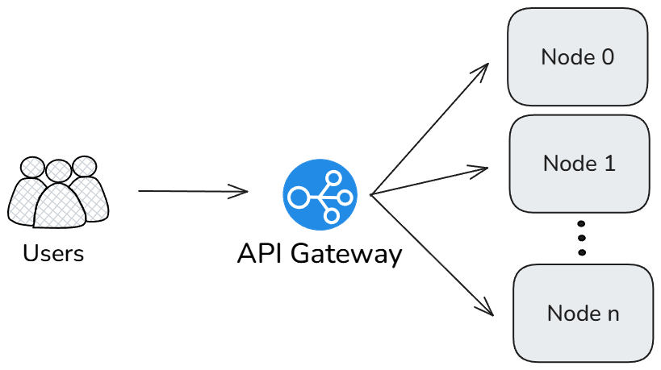
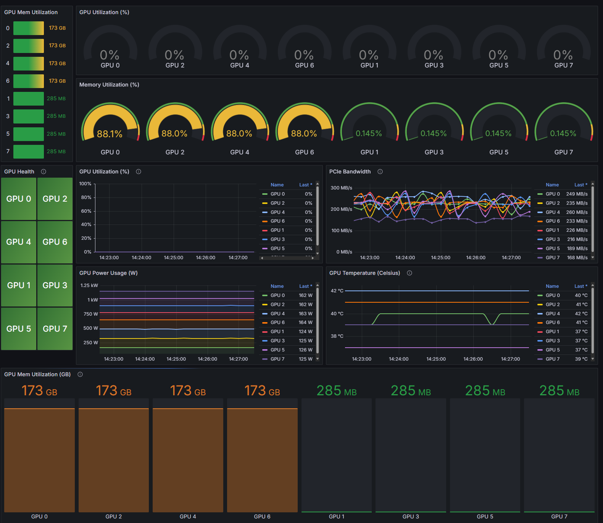
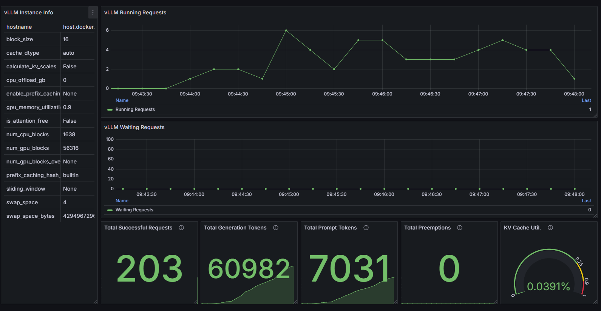

# Multi-node inference load balancing

This guide describes how to set up a scalable, high-performance multi-node LLM inference cluster using AMD GPUs, supporting efficient horizontal scaling and highly available deployments.

## Architecture overview

This solution implements a distributed LLM inference system with three main components:

- **Inference pool**: Multiple inference nodes running vLLM or SGLang servers on AMD GPUs using tensor parallelism.
- **API gateway layer**: A unified entry point that distributes requests across the inference pool. This guide demonstrates two options:
  - A [LiteLLM](https://docs.litellm.ai/docs/)-based load balancer - optimized for LLM workloads with built-in observability.
  - An [Nginx](https://nginx.org/)-based load balancer - a production-grade reverse proxy with high performance.
- **Monitoring layer**: Prometheus and Grafana for comprehensive metrics collection and visualization, with additional load testing tools.

This architecture allows horizontal scaling by adding more inference nodes while maintaining a single API endpoint for client applications. This architecture supports various model sizes:

- **Small models**: Can run efficiently on a single GPU.
- **Medium models**: Typically require two or more GPUs with tensor parallelism.
- **Large models**: Requires multi-node deployments for high availability and performance.

**Tensor Parallelism** distributes model layers across multiple GPUs, allowing inference of models too large to fit in a single GPU's memory. The `--tensor-parallel-size` (`-tp`) parameter determines how many GPUs will share the model weights.

### Logical diagram



## Prerequisites

- Multiple ROCm-compatible nodes with AMD GPUs.
- Docker and Docker Compose installed on all nodes.
- Network connectivity between nodes.
- Models downloaded to a shared or local storage location.

### NUMA configuration

For optimal performance, disable automatic NUMA balancing on each node before starting the inference servers:

```bash
# Disable automatic NUMA balancing
sudo sh -c 'echo 0 > /proc/sys/kernel/numa_balancing'

# Verify NUMA balancing is disabled (should return 0)
cat /proc/sys/kernel/numa_balancing
```

## Deployment

This section provides step-by-step instructions for deploying components for multi-node inference load balancing.

### Project structure

```text
/llm-cluster/
├── nodes/                 # Inference node files
│   ├── docker-compose.yml
├── gateway/               # API Gateway/Load Balancer files
│   ├── litellm
│   │   ├── config.yaml
│   │   └── docker-compose.yml
│   └── nginx
│       ├── docker-compose.yml
│       └── nginx.conf         
├── monitoring/            # Monitoring stack files
│   ├── docker-compose.yml
│   ├── grafana/
│   │   ├── datasources.yml
│   │   ├── Instinct_Dashboard.json
│   │   └── vLLM_Dashboard.json
│   ├── influxdb/
│   ├── prometheus/
│   │   └── prometheus.yml
│   └── scripts/
│       ├── chat-completions-test.js
│       ├── helpers/
│       │   └── openaiGeneric.js
│       ├── prompt-length-test.js
│       ├── ramp-up-test.js
│       └── stress-test.js
```

### Inference pool setup

Perform these actions on each inference node.

1. Create the directory structure:

    ```bash
    mkdir -p ~/llm-cluster/nodes
    cd ~/llm-cluster/nodes
    ```

1. Create a `.env` file in the `nodes/` folder the with appropriate configuration for your environment:

    ```bash
    NODE_ID=node1               # Unique identifier for this node
    MODEL_PATH=/path/to/models  # Path to local or shared model storage
    MODEL_NAME=Llama-3.1-8B-Instruct  # Model to deploy
    TP_SIZE=4                   # Tensor parallelism degree (number of GPUs to use)
    GPU_DEVICES=0,1,2,3         # GPU devices to use
    PORT=8000                   # Port to expose the inference API
    SHM_SIZE=32GB               # Shared memory size for container
    ```

1. Create a `docker-compose.yml` file for the inference nodes. Two options are provided below for different inference backends.

    **vLLM example**

    ```yaml
    services:
      vllm:
        image: rocm/vllm:instinct_main
        container_name: vllm_${NODE_ID:-node1}
        shm_size: ${SHM_SIZE:-32GB}
        ipc: host
        network_mode: host
        devices:
          - /dev/kfd
          - /dev/dri
        group_add:
          - video
        security_opt:
          - seccomp=unconfined
        volumes:
          - ${MODEL_PATH}:/data/models
        environment:
          - ROCR_VISIBLE_DEVICES=${GPU_DEVICES:-0,1,2,3}
        command: >
          vllm serve /data/models/${MODEL_NAME}
          --dtype float16
          --tensor-parallel-size ${TP_SIZE:-4}
          --port ${PORT:-8000}
        restart: unless-stopped
    ```

   **SGLang example**

    ```yaml
    services:
      sglang:
        image: lmsysorg/sglang:v0.4.6.post2-rocm630
        container_name: sglang_${NODE_ID:-node1}
        shm_size: ${SHM_SIZE:-32GB}
        ipc: host
        network_mode: host
        devices:
          - /dev/kfd
          - /dev/dri
        group_add:
          - video
        security_opt:
          - seccomp=unconfined
        volumes:
          - ${MODEL_PATH}:/data/models
        environment:
          - ROCR_VISIBLE_DEVICES=${GPU_DEVICES:-0,1,2,3}
          - RCCL_MSCCL_ENABLE=0
          - CK_MOE=1
          - HSA_NO_SCRATCH_RECLAIM=1
        command: >
          python3 -m sglang.launch_server
          --model /data/models/${MODEL_NAME}
          --tp ${TP_SIZE:-4}
          --trust-remote-code
          --port ${PORT:-8000}
          --enable-metrics
        restart: unless-stopped
    ```

1. Start the inference services:

    ```bash
    docker compose up -d
    ```

### API gateway setup

On the API gateway node, create the gateway directory structure:

```bash
mkdir -p ~/llm-cluster/gateway
cd ~/llm-cluster/gateway
```

Choose one of the following gateway options based on your requirements.

#### Option 1: LiteLLM-based load balancer

LiteLLM provides specialized routing, load balancing, and observability for LLM API calls, supporting multiple LLM providers and models through a unified OpenAI-compatible interface.

1. Create `docker-compose.yml` for LiteLLM:

    ```yaml
    services:
      litellm:
        image: ghcr.io/berriai/litellm:main-stable
        container_name: litellm_gateway
        network_mode: host
        volumes:
          - ./config.yaml:/app/config.yaml
        command: ["--config", "/app/config.yaml", "--port", "4000", "--num_workers", "8"]
        environment:
          LITELLM_MASTER_KEY: "${LITELLM_MASTER_KEY}"
        env_file: .env
        restart: unless-stopped
        logging:
          driver: "json-file"
          options:
            max-size: "10m"
            max-file: "3"
    ```

1. Create `config.yaml` to define the model routing configuration:

    ```yaml
    model_list:
      - model_name: DeepSeek-R1
        litellm_params:
          model: openai/deepseek-ai/DeepSeek-R1
          api_base: http://node0:8000/v1
      
      - model_name: DeepSeek-R1
        litellm_params:
          model: openai/deepseek-ai/DeepSeek-R1
          api_base: http://node1:8000/v1

      # Add additional nodes as needed
      # - model_name: DeepSeek-R1
      #   litellm_params:
      #     model: openai/deepseek-ai/DeepSeek-R1
      #     api_base: http://nodeN:8000/v1

    # Configure load balancing
    router_settings:
      routing_strategy: least-busy  # Distributes requests to least busy nodes
      num_retries: 3                # Number of retries if a request fails
      timeout: 300                  # Request timeout in seconds
    ```

1. Create `.env` file with your API key:

    ```bash
    LITELLM_MASTER_KEY=sk-1234
    ```

    ```{note}
    For production environments, replace the default key with a strong, randomized value.
    ```

1. Start the LiteLLM gateway:

    ```bash
    docker compose up -d
    ```

1. Verify that all LLM endpoints are healthy:

    ```bash
    curl -X 'GET' \
      'http://localhost:4000/health' \
      -H 'accept: application/json' \
      -H 'Authorization: Bearer sk-1234' | jq
    ```

    **Expected output**

    ```json
    {
      "healthy_endpoints": [
        {
          "model": "openai/deepseek-ai/DeepSeek-R1",
          "api_base": "http://node0:8000/v1"
        },
        {
          "model": "openai/deepseek-ai/DeepSeek-R1",
          "api_base": "http://node1:8000/v1"
        },
        {
          "model": "openai/deepseek-ai/DeepSeek-R1",
          "api_base": "http://node2:8000/v1"
        },
        {
          "model": "openai/deepseek-ai/DeepSeek-R1",
          "api_base": "http://node3:8000/v1"
        }
      ],
      "unhealthy_endpoints": [],
      "healthy_count": 4,
      "unhealthy_count": 0
    }
    ```

##### LiteLLM monitoring options

LiteLLM provides several monitoring and observability options:

- **Basic logging**: Available in the open source version, provides request/response logging and basic metrics
- **Callback integrations**: LiteLLM supports custom callbacks for advanced monitoring with tools like:
  - [LangFuse](https://docs.litellm.ai/docs/observability/langfuse_integration)
  - [Helicone](https://docs.litellm.ai/docs/observability/helicone_integration)
  - [LangSmith](https://docs.litellm.ai/docs/observability/langsmith_integration)
  - Custom callback handlers

This guide uses the open source version of LiteLLM with an internal Prometheus/Grafana stack for system-level monitoring. If you need LLM-specific tracing and observability, consider exploring the callback integrations.

#### Option 2: Nginx-based load balancer

Nginx provides a high-performance, scalable HTTP server and reverse proxy that can efficiently distribute traffic across multiple inference nodes.

1. Create `nginx.conf` with the following configuration:

    ```text
    worker_processes auto;
    worker_rlimit_nofile 65535;
    events {
        worker_connections 65535;
    }

    http {
        include       mime.types;
        default_type  application/octet-stream;
        sendfile      on;
        keepalive_timeout 65;

        # Define upstream server group
        upstream vllm_pool {
            # Use least_conn for distributing traffic based on least number of current connections
            least_conn;
            
            # Add inference server entries - update with your node hostnames/IPs
            server node0:8000;
            server node1:8000;
            # Add additional nodes as needed
            # server nodeN:8000;
            
            keepalive 32;
        }

        server {
            listen 80;
            
            # Health check endpoint
            location /health {
                return 200 'healthy\n';
                add_header Content-Type text/plain;
            }

            # API endpoint for frontend clients
            location / {
                proxy_pass http://vllm_pool;
                proxy_http_version 1.1;
                proxy_set_header Connection "";
                proxy_set_header Host $host;
                proxy_set_header X-Real-IP $remote_addr;
                proxy_set_header X-Forwarded-For $proxy_add_x_forwarded_for;
                
                # Timeouts for long-running inference requests
                proxy_connect_timeout 300s;
                proxy_read_timeout 300s;
                proxy_send_timeout 300s;
                
                # Buffer settings for large responses
                proxy_buffer_size 16k;
                proxy_buffers 8 16k;
                proxy_busy_buffers_size 32k;
            }
        }
    }
    ```

1. Create `docker-compose.yml` for Nginx:

    ```yaml
    services:
      nginx:
        image: nginx:latest
        container_name: nginx_gateway
        network_mode: host
        volumes:
          - ./nginx.conf:/etc/nginx/nginx.conf:ro
        restart: unless-stopped
        logging:
          driver: "json-file"
          options:
            max-size: "10m"
            max-file: "3"
    ```

1. Start the Nginx gateway:

    ```bash
    docker compose up -d
    ```

##### Monitoring Nginx gateway

To enable monitoring for your Nginx gateway, add the `nginx-prometheus-exporter`:

1. Update `docker-compose.yml` to include the exporter:

    ```yaml
    services:
      nginx:
        # ...existing nginx configuration...

      nginx-exporter:
        image: nginx/nginx-prometheus-exporter:latest
        container_name: nginx_exporter
        command:
          - --nginx.scrape-uri=http://localhost/stub_status
        network_mode: host
        restart: unless-stopped
        depends_on:
          - nginx
    ```

1. Add a status endpoint to `nginx.conf` inside the server block:

    ```text
    location /metrics {
        stub_status on;
        access_log off;
        allow 127.0.0.1;
        deny all;
    }
    ```

## Monitoring stack setup

Perform these steps on the monitoring node.

1. Create the monitoring directory structure:

    ```bash
    mkdir -p ~/llm-cluster/monitoring/{prometheus,grafana,influxdb}
    cd ~/llm-cluster/monitoring
    ```

1. Set appropriate permissions for Grafana and InfluxDB data directories:

    ```bash
    # Set permissions to allow container processes to write data
    chmod 777 ~/llm-cluster/monitoring/grafana
    chmod 777 ~/llm-cluster/monitoring/influxdb
    ```

1. Create `docker-compose.yml` for the monitoring stack:

    ```yaml
    services:
      # Check https://hub.docker.com/r/rocm/device-metrics-exporter/tags for the latest version
      device-metrics-exporter:
        image: rocm/device-metrics-exporter:v1.3.0-beta.1
        container_name: device-metrics-exporter
        restart: unless-stopped
        group_add:
          - video    
        volumes:
          - ./config.json:/etc/metrics/config.json
        devices:
          - /dev/kfd
          - /dev/dri
        ports:
          - "5000:5000"

      prometheus:
        image: prom/prometheus:latest
        container_name: prometheus
        volumes:
          - ./prometheus/prometheus.yml:/etc/prometheus/prometheus.yml
        command:
          - '--config.file=/etc/prometheus/prometheus.yml'
        ports:
          - "9090:9090"
        restart: unless-stopped

      influxdb:
        image: influxdb:1.11.8
        container_name: influxdb
        ports:
          - "8086:8086"
        environment:
          - INFLUXDB_DB=k6
          - INFLUXDB_ADMIN_USER=admin
          - INFLUXDB_ADMIN_PASSWORD=admin
        volumes:
          - ./influxdb:/var/lib/influxdb

      grafana:
        image: grafana/grafana:latest
        container_name: grafana
        volumes:
          - ./grafana/datasources.yml:/etc/grafana/provisioning/datasources/datasources.yml
          - ./grafana:/var/lib/grafana
        environment:
          - GF_SECURITY_ADMIN_PASSWORD=${GRAFANA_ADMIN_PASSWORD:-admin}
        ports:
          - "3000:3000"
        depends_on:
          - prometheus
        restart: unless-stopped
    ```

1. Create `prometheus/prometheus.yml` to configure metrics collection:

    ```yaml
    global:
      scrape_interval: 15s

    scrape_configs:
      # Host OS metrics
      - job_name: 'node'
        static_configs:
        - targets: ['localhost:9100']

      # Inference servers
      - job_name: 'vllm'
        metrics_path: /metrics
        scrape_interval: 15s
        static_configs:
          - targets: ['node0:8000', 'node1:8000'] # Add additional nodes as needed
            labels:
              service: 'vllm'
      
      # Nginx Gateway metrics (if using Nginx with nginx-prometheus-exporter)
      - job_name: 'nginx'
        scrape_interval: 15s
        metrics_path: /metrics
        static_configs:
          - targets: ['localhost:9113']
        relabel_configs:
          - source_labels: [__address__]
            target_label: instance
            replacement: 'nginx-gateway'

      # AMD GPU device metrics
      - job_name: 'amd_gpu_metrics'
        scrape_interval: 5s
        metrics_path: /metrics
        static_configs:
          - targets: ['node0:5000', 'node1:5000']
            labels:
              service: 'amd_gpu_metrics'        
    ```

    ```{note}
    Replace `node0` and `node1` with the actual hostnames or IP addresses of your inference nodes. When running Prometheus in a docker container, change instances of `localhost` to `host.docker.internal`. 
    ```

1. Create `grafana/datasources.yml` to configure the Prometheus data source:

    ```yaml
    apiVersion: 1

    datasources:
      - name: Prometheus
        type: prometheus
        access: proxy
        url: http://prometheus:9091
        isDefault: true

      - name: InfluxDB
        type: influxdb
        access: proxy
        url: http://influxdb:8086
        database: k6
        user: admin
        password: admin
        editable: true    
    ```

1. Start the monitoring services:

    ```bash
    docker compose up -d
    ```

## Testing and performance evaluation

Once your multi-node inference system is deployed, you can validate its functionality and evaluate its performance.

### Testing with LiteLLM gateway

Send a test request to the LiteLLM endpoint:

```bash
curl http://localhost:4000/v1/completions \
  -H "Content-Type: application/json" \
  -H "Authorization: Bearer sk-1234" \
  -d '{"model": "DeepSeek-R1", "prompt": "What is AMD Instinct?", "max_tokens": 256, "temperature": 0.0}'
```

### Testing with Nginx gateway

Send a test request to the Nginx endpoint:

```bash
curl http://localhost/v1/completions \
  -H "Content-Type: application/json" \
  -d '{"model": "DeepSeek-R1", "prompt": "What is AMD Instinct?", "max_tokens": 256, "temperature": 0.0}'
```

Expected output format (content may vary):

```json
{
  "text": [
    "What is AMD Instinct? AMD Instinct is a line of high-performance computing (HPC) and 
    artificial intelligence (AI) accelerators designed for datacenter and cloud computing 
    applications. It is based on AMDs Radeon Instinct architecture, which is optimized for HPC
    and AI workloads. AMD Instinct accelerators are designed to provide high-performance 
    computing and AI acceleration for a wide range of applications, including scientific simulations, 
    data analytics, machine learning, and deep learning.
     
    AMD Instinct accelerators are based on AMDs Radeon Instinct architecture, which is designed 
    to provide high-performance computing and AI acceleration. They are built on a 7nm process node 
    and feature a high-performance GPU core, as well as a large amount of memory and bandwidth to 
    support high-performance computing and AI workloads.
     
    AMD Instinct accelerators are designed to be used in a variety of applications, including:
    Scientific simulations: AMD Instinct accelerators can be used to accelerate complex scientific 
    simulations, such as weather forecasting, fluid dynamics, and molecular dynamics.
    Data analytics: AMD Instinct accelerators can be used to accelerate data analytics workloads,
    such as data compression, data encryption, and data mining.
    Machine learning: AMD Instinct accelerators can be used to accelerate machine learning workloads"
  ]
}
```

### Performance testing with Apache Bench

Apache Bench (`ab`) is a lightweight tool for benchmarking HTTP servers, ideal for quick performance evaluation.

#### Installation options

Option 1: Install Apache Bench Locally

```bash
sudo apt-get update
sudo apt-get install apache2-utils
```

Option 2: Run Apache Bench in a Container

```bash
docker run -it --rm \
  --shm-size=8GB \
  --ipc=host \
  --network=host \
  --entrypoint bash \
  ubuntu/apache2:2.4-22.04_beta
```

#### Running Apache Bench tests

1. Create a request payload file:

    ```bash
    cat > postdata << EOF
    {"model": "DeepSeek-R1", "prompt": "What is AMD Instinct?", "max_tokens": 256, "temperature": 0.0}
    EOF
    ```

1. Run the benchmark with desired concurrency and request count:

    ```bash
    ab -n 1000 -c 100 -T application/json -p postdata -H "Authorization: Bearer sk-1234" http://localhost:4000/v1/completions
    ```

Key parameters:

- `-n 1000`: Total number of requests to perform
- `-c 100`: Number of concurrent requests
- `-T application/json`: Content-type header for POST data
- `-p postdata`: File containing data to POST
- `-H`: Additional header for authentication

#### Sample performance test commands

Here are examples of commands to test different models and configurations:

```bash
# Test with Llama-3.1-8B-Instruct
ab -n 20000 -c 2000 -T application/json -p postdata http://localhost:80/v1/completions

# Test with Llama-3.1-405B-Instruct
ab -n 20000 -c 2000 -T application/json -p postdata http://localhost:80/v1/completions

# Test with DeepSeek-R1
ab -n 20000 -c 2000 -T application/json -p postdata http://localhost:80/v1/completions
```

### Advanced load testing with k6

For more sophisticated load testing scenarios, Grafana k6 offers enhanced capabilities including detailed metrics collection and realistic user simulation. The test scripts used in this section are available to download from [https://github.com/ROCm/gpu-cluster-networking/examples/llm-cluster/monitoring/scripts](https://github.com/ROCm/gpu-cluster-networking/examples/llm-cluster/monitoring/scripts)

#### Installing k6

Option 1: Install k6 locally

```bash
apt install -y k6
```

For additional installation options, refer to the [official k6 installation guide](https://grafana.com/docs/k6/latest/set-up/install-k6/).

Option 2: Run k6 in a Container

```bash
docker run --rm -i \
  --network=host \
  -v ${PWD}/scripts:/scripts \
  -e "OPENAI_URL=http://localhost:4000" \
  -e "API_KEY=sk-1234" \
  -e "MODEL_NAME=DeepSeek-R1" \
  grafana/k6 run /scripts/chat-completions-test.js
```

#### Setting up k6

Configure environment variables for the test scripts:

```bash
cd ~/llm-cluster/monitoring/scripts
cat > .env << EOL
export OPENAI_URL=http://localhost:4000  # Use your LiteLLM or Nginx endpoint
export API_KEY=sk-1234                   # API key if required by your gateway
export MODEL_NAME=DeepSeek-R1            # Your deployed model name
EOL

source .env
```

#### Running k6 test scripts

The repository includes several specialized test scripts for different testing scenarios:

##### Chat completions test

```bash
k6 run --out influxdb=http://localhost:8086/k6 chat-completions-test.js
```

##### Ramp-up test

```bash
k6 run --out influxdb=http://localhost:8086/k6 ramp-up-test.js
```

##### Stress test

```bash
k6 run --out influxdb=http://localhost:8086/k6 stress-test.js
```

##### Prompt length test

```bash
k6 run --out influxdb=http://localhost:8086/k6 prompt-length-test.js
```

On completion, `k6` will provide a summary similar to this:

```text
$ k6 run --out influxdb=http://localhost:8086 scripts/chat-completions-test.js

         /\      Grafana   /‾‾/
    /\  /  \     |\  __   /  /
   /  \/    \    | |/ /  /   ‾‾\
  /          \   |   (  |  (‾)  |
 / __________ \  |_|\_\  \_____/

     execution: local
        script: scripts/chat-completions-test.js
        output: InfluxDBv1 (http://localhost:8086)

     scenarios: (100.00%) 1 scenario, 5 max VUs, 1m30s max duration (incl. graceful stop):
              * default: 5 looping VUs for 1m0s (gracefulStop: 30s)

  █ THRESHOLDS

    http_req_duration
    ✓ 'p(95)<5000' p(95)=1.66s

    http_req_failed
    ✓ 'rate<0.01' rate=0.00%


  █ TOTAL RESULTS

    checks_total.......................: 170     2.64314/s
    checks_succeeded...................: 100.00% 170 out of 170
    checks_failed......................: 0.00%   0 out of 170

    ✓ is status 200
    ✓ has valid JSON response

    CUSTOM
    completion_tokens...................: avg=100       min=100      med=100       max=100       p(90)=100       p(95)=100
    prompt_tokens.......................: avg=26        min=26       med=26        max=26        p(90)=26        p(95)=26
    tokens_per_second...................: avg=83.173393 min=57.87037 med=87.565674 max=91.324201 p(90)=90.546921 p(95)=90.810037
    total_tokens........................: avg=126       min=126      med=126       max=126       p(90)=126       p(95)=126

    HTTP
    http_req_duration...................: avg=1.21s     min=1.09s    med=1.14s     max=1.72s     p(90)=1.44s     p(95)=1.66s
      { expected_response:true }........: avg=1.21s     min=1.09s    med=1.14s     max=1.72s     p(90)=1.44s     p(95)=1.66s
    http_req_failed.....................: 0.00% 0 out of 85
    http_reqs...........................: 85    1.32157/s

    EXECUTION
    iteration_duration..................: avg=3.67s     min=2.16s    med=3.62s     max=5.35s     p(90)=4.82s     p(95)=4.96s
    iterations..........................: 85    1.32157/s
    vus.................................: 1     min=1       max=5
    vus_max.............................: 5     min=5       max=5

    NETWORK
    data_received........................: 87 kB 1.3 kB/s
    data_sent............................: 31 kB 477 B/s

running (1m04.3s), 0/5 VUs, 85 complete and 0 interrupted iterations
default ✓ [======================================] 5 VUs  1m0s
```

#### Viewing k6 test results

After running the tests, you can view the results in Grafana:

1. Open Grafana at `http://<your-monitoring-node-ip>:3000`
2. Log in with your credentials (default: admin/admin, unless changed via `GRAFANA_ADMIN_PASSWORD` environment variable)
3. Access the k6 dashboard by importing the dashboard ID `14801` or by navigating to the pre-configured dashboard if available. The dashboard can be found at: [https://grafana.com/grafana/dashboards/14801-k6-dashboard/](https://grafana.com/grafana/dashboards/14801-k6-dashboard/)

The k6 dashboard provides detailed metrics about request rates, response times, errors, and other performance indicators that help you understand your system's behavior under load.

## Monitoring and visualization

### Available dashboards

The monitoring stack includes pre-configured Grafana dashboards for comprehensive system visibility. These dashboards are provided in the repository's `examples/llm-cluster/monitoring/grafana` directory:

**AMD Instinct dashboard** (`Instinct_Dashboard.json`): Monitors GPU performance metrics including temperature, utilization, memory usage, and power consumption. Also available at [AMD Instinct Single Node Dashboard](https://grafana.com/grafana/dashboards/23434-amd-instinct-single-node-dashboard/).



**vLLM dashboard** (`vLLM_Dashboard.json`): Provides insights into vLLM server performance, including request throughput, latency metrics, and queue statistics.



Additional recommended dashboards for comprehensive monitoring:

- **k6 dashboard**: Visualizes load test results with detailed performance metrics. Available for import into Grafana with ID `14801` or at [https://grafana.com/grafana/dashboards/14801-k6-dashboard/](https://grafana.com/grafana/dashboards/14801-k6-dashboard/).

- **vLLM reference dashboard**: Official dashboard from the vLLM project for detailed inference metrics. Available at [https://github.com/vllm-project/vllm/blob/main/examples/online_serving/prometheus_grafana/grafana.json](https://github.com/vllm-project/vllm/blob/main/examples/online_serving/prometheus_grafana/grafana.json).

- **NGINX dashboard**: Official dashboard for the NGINX Prometheus exporter. [https://grafana.com/grafana/dashboards/12767-nginx/](https://grafana.com/grafana/dashboards/12767-nginx/)

For instructions on importing dashboards into your Grafana instance, follow the official [Grafana Dashboard Import Guide](https://grafana.com/docs/grafana/latest/dashboards/build-dashboards/import-dashboards/).

## Performance optimization recommendations

Achieving optimal performance for your multi-node inference deployment requires experimentation and continuous monitoring. This section provides recommendations for tuning your setup based on your specific workload characteristics.

### Compare different configurations

To identify the optimal setup for your specific use case, systematically test different configurations.

- Load balancer options
  - **LiteLLM**: Generally provides better handling of LLM-specific requirements like streaming responses and specialized routing
  - **Nginx**: Often delivers higher raw throughput for simple completion requests and offers more configuration flexibility
- Inference servers
  - **vLLM**: [https://docs.vllm.ai/](https://docs.vllm.ai/)
  - **SGLang**: [https://docs.sglang.ai/](https://docs.sglang.ai/)
  - **TGI**: [https://huggingface.co/docs/text-generation-inference/index](https://huggingface.co/docs/text-generation-inference/index)
- Inference configuration
  - Test different tensor parallel sizes to find the optimal balance between throughput and latency.
  - Experiment with batch sizes (`--max-batch-size` in vLLM) to increase throughput for concurrent requests.
  - Try different quantization options to improve memory efficiency.

### Using historical performance data

You can use the monitoring setup in this guide to review stored historical performance data and track changes over time:

- Establish performance baselines
  - Run benchmark tests after initial setup to establish baseline performance metrics.
  - Document key metrics like tokens per second, request latency, and GPU utilization.
- Track performance trends
  - Set up Grafana dashboards with time series views of key metrics.
  - Create alerts for significant deviations from established baselines.

### System-level optimizations

Beyond the application components themselves, consider these system-level optimizations:

- Network configuration
  - Ensure nodes have sufficient network bandwidth for model weight synchronization.
  - Consider using dedicated network interfaces for inter-node communication.
- Host OS tuning
  - Adjust kernel parameters related to networking and memory management.
  - The NUMA configuration mentioned earlier in this guide is just one example.

You can find more information on system optimization at these links:

- System optimization guides: [https://rocm.docs.amd.com/en/latest/how-to/system-optimization/index.html](https://rocm.docs.amd.com/en/latest/how-to/system-optimization/index.html)
- Performance guides: [https://rocm.docs.amd.com/en/latest/how-to/gpu-performance/mi300x.html](https://rocm.docs.amd.com/en/latest/how-to/gpu-performance/mi300x.html)
- Instinct single node networking: [https://instinct.docs.amd.com/projects/gpu-cluster-networking/en/latest/how-to/single-node-config.html](https://instinct.docs.amd.com/projects/gpu-cluster-networking/en/latest/how-to/single-node-config.html)
- Instinct multi-node networking: [https://instinct.docs.amd.com/projects/gpu-cluster-networking/en/latest/how-to/multi-node-config.html](https://instinct.docs.amd.com/projects/gpu-cluster-networking/en/latest/how-to/multi-node-config.html)

### Cost-performance balance

When scaling your cluster, consider both performance and resource utilization:

- Right-sizing
  - Use Grafana dashboards to identify under-utilized resources.
  - Scale the number of nodes based on actual usage patterns and SLAs.
- Workload scheduling
  - Consider dedicating specific nodes to different models based on usage patterns.
  - Use metrics to identify peak usage times and scale accordingly.

By systematically testing configurations and leveraging the monitoring data, you can continuously optimize your multi-node inference setup to achieve the best balance of performance, reliability, and resource efficiency.

## Repository resources

All configuration files, scripts, and dashboards referenced in this guide are available in the ROCm GPU Cluster Networking GitHub repository:

[https://github.com/ROCm/gpu-cluster-networking/examples/llm-cluster](https://github.com/ROCm/gpu-cluster-networking/examples/llm-cluster)

The repository includes:

- Docker Compose files for inference nodes (vLLM and SGLang examples)
- API Gateway configurations (LiteLLM and Nginx examples)
- Monitoring stack setup with Prometheus, Grafana, and InfluxDB
- Grafana dashboards for AMD Instinct GPUs and vLLM
- Benchmark scripts for Apache Bench and k6
- Example configuration files and setup scripts
