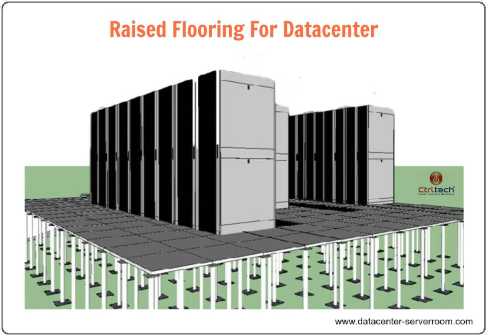
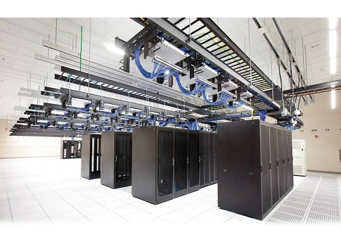
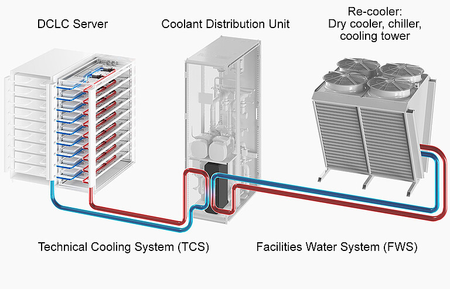
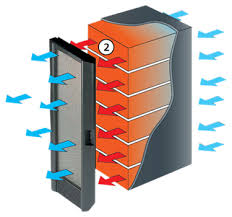
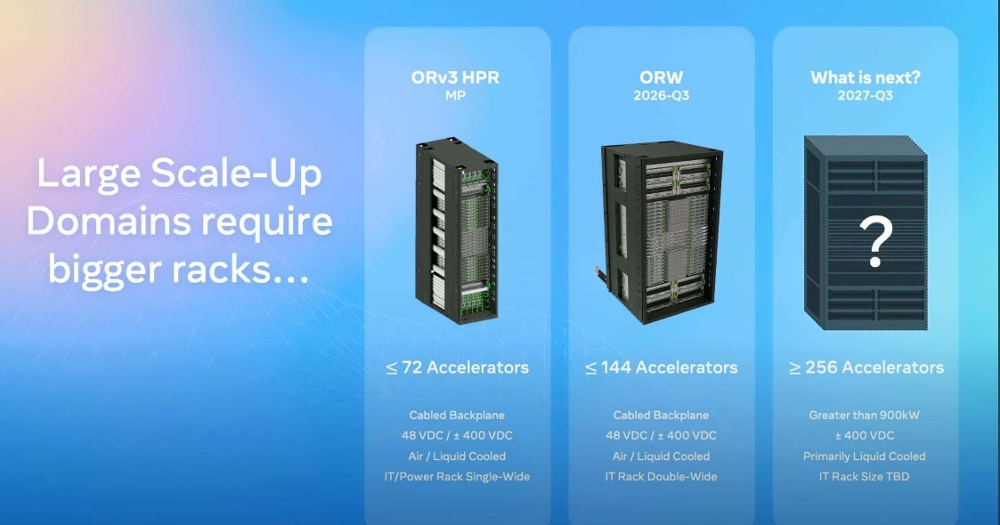
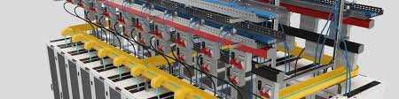

.. meta::
   :description: An overview of AMD Instinct data center architecture covering power, cooling, networking, storage, and resiliency design for high-density AI and HPC deployments.
   :keywords: AMD Instinct, data center, HPC, AI, cooling, power, networking, storage, ORV3, RDHx, DLC, fat tree, rail-optimized

************************************************************************************************************************
Data Center Design Guide
************************************************************************************************************************

The rapid evolution of high performance computing (HPC), artificial intelligence (AI) and machine learning (ML) has
driven significant changes in data center infrastructure. These workloads demand unprecedented compute power, memory
bandwidth, and interconnect throughput to achieve the performance required for next-generation applications.

As organizations scale these deployments to tackle complex problems—from natural language processing to autonomous
systems—data centers must evolve to support higher power densities, advanced cooling systems, and robust networking
fabrics capable of sustaining hundreds of terabits of aggregate bandwidth.

This means the requirements for the data center as we know it must change to accommodate the current high density,
power, and cooling demands of modern accelerated computing.

Challenges
========================================================================================================================

A non-exhaustive list of challenges are faced when deploying dense, high-powered racks at modest to large scale. Many of
these challenges co-exist and compound each other.

Power delivery infrastructure
------------------------------------------------------------------------------------------------------------------------

Supplying hundreds of kilowatts (kW) per rack requires massive power feeds, high-capacity busbars and redundant power
distribution units (PDUs), often requiring upgrades to building electrical infrastructure. At these loads, current can
exceed thousands of amps where low voltage (110-240V) distribution is used, so in the interest of safety and efficiency
the industry is moving toward higher voltages like 380-415V AC or 48V DC within racks to reduce current and losses.
Reliability adds further complexity: N+1 or 2N redundancy becomes more difficult and expensive at these scales, and UPS
and backup power must be migrated and right-sized for extreme loads.

Cooling challenges
------------------------------------------------------------------------------------------------------------------------

At 300-400KW per rack, there is considerable heat load to be removed. Traditional air cooling is not optimal or even
feasible at this density, necessitating liquid cooling solutions like direct liquid cooling (DLC) or immersion cooling.
Maintaining a uniform temperature throughout the system is equally critical, as large discrepancies can cause mechanical
and thermal stress that leads to premature failures. To support this, cooling infrastructure must scale accordingly, and
potentially be modularized throughout the constellation of racks, where each unit has its own loop and is joined to the
overall chiller plant.

Physical space and ancillary rack design
------------------------------------------------------------------------------------------------------------------------

Solutions like MI430/450/455X 72GPU and higher come in robust racks with quite a weight load to the floor, requiring
special floor reinforcement and structural considerations. The rack footprint may also differ from the 19 inch standard,
meaning existing raised floors may not be compatible.

Cable management
------------------------------------------------------------------------------------------------------------------------

The required power cables, piping for liquid cooling, and large amount of fiber optic cabling for the high bandwidth
network fabrics all have to be managed with care to allow for proper air flow.

Energy efficiency and sustainability
------------------------------------------------------------------------------------------------------------------------

If the cooling and power distribution are not built to efficient standards, power usage effectiveness (PUE) may get much
worse. Heat reuse is also constrained: with the limited range of the primary and secondary liquid cooling loops (18 - 45C
inlet temperature), reuse opportunities are limited or require additional heat pumps.

Safety and risk management
------------------------------------------------------------------------------------------------------------------------

Higher energy densities increase fire hazards, requiring mandatory advanced fire suppression, while the high current and
voltage raise the risk of severe electrical accidents from arc flash. Liquid cooling introduces further potential for
leaks, requiring robust containment, leak detection and monitoring / alerting. Maintenance personnel need to be trained
in handling high power feeds, conduits, and cabling. Human interaction in these environments is highly regulated for good
reason and requires specialized training for any personnel working in the space.

Operational and maintenance complexity
------------------------------------------------------------------------------------------------------------------------

Technicians need expertise in high voltage systems with liquid cooling, and strict procedures on operating the power
circuits in these environments. Downtime carries a heavy cost as well: failures at any level of the system can impact
massive compute capacity, necessitating a regular schedule of predictive maintenance using telemetry from the entire
system.

Cost implications
------------------------------------------------------------------------------------------------------------------------

Upfront capital investment (CapEx) in power provisioning, which may include municipal infrastructure work, and cooling
of data centers at extreme power levels is non-linear compared to traditional deployment. Operating costs (OpEx) follow
the same pattern: energy costs are nonlinear for high-capacity demands, where fluctuations in power requirements can
cost more than the actual energy consumed, and complex infrastructure also increases maintenance costs.

Raised floor versus concrete slab
=================================

The choice between a raised floor or a concrete slab architecture is a critical design decision in modern high-density
data centers. Each approach has distinct advantages and challenges, particularly for AI and HPC workloads requiring
extreme power and cooling densities.

Raised floor design
-------------------

Raised floors create an underfloor plenum typically used for distributing chilled air, power cabling, and sometimes
liquid cooling pipes. This approach offers several operational advantages. By delivering cold air directly to rack
intakes through perforated tiles, it simplifies airflow management, while the plenum itself provides concealed pathways
for power and network cables that reduce clutter. It also affords flexibility, making it easier to reconfigure airflow
patterns and cable layouts during upgrades.

These benefits diminish under high-density loads. Air cooling beneath raised floors struggles to handle the extreme heat
loads of modern accelerated computing (in excess of 50 kW per rack), rendering the approach unsuitable for AI clusters.
The floors must also support heavy racks and liquid cooling equipment, which requires reinforced panels, and routing
large-diameter coolant pipes underfloor can be both cumbersome and leak-prone.

Concrete slab design
--------------------

Concrete slab floors eliminate the underfloor plenum, relying instead on overhead distribution for power, networking,
and cooling infrastructure. This design plays to the strengths of dense deployments. Its structural strength makes it
better suited for heavy racks and immersion cooling tanks, and overhead manifolds and busways simplify the integration
of direct-to-chip or immersion cooling. Moving distribution above the floor also improves airflow management, enabling
hot and cold aisle containment without underfloor constraints.

The trade-offs center on distribution above the racks. Power and network cables must be routed through overhead trays,
which can increase visual clutter, and air distribution has to be handled through overhead ducts or in-row cooling units
rather than a plenum. 

For ultra high-density AI data centers, concrete slab designs are generally preferred due to their 
compatibility with liquid cooling, structural robustness, and simplified integration of modular power 
systems. Raised floors remain viable for moderate-density environments but are increasingly impractical 
where racks exceed 6500lbs (3400kg).

**Comparison**

.. list-table::
   :header-rows: 1
   :widths: 20 40 40

   * - Factor
     - Raised Floor
     - Concrete Slab
   * - Cooling approach
     - Underfloor air distribution; limited for >50 kW/rack.
     - Overhead cooling manifolds; ideal for liquid cooling.
   * - Power distribution
     - Underfloor cabling; limited space for large feeds.
     - Overhead busways; supports high-power modular feeds.
   * - Liquid cooling
     - Difficult to integrate; leak risks.
     - Natively supports manifolds, RDHx, and DLC.
   * - Structural load
     - Limited; requires reinforced panels.
     - High capacity; ideal for dense racks.
   * - Scalability
     - Limited by floor capacity and airflow constraints.
     - Modular and scalable for multi-megawatt deployments.
   * - Maintenance
     - Easy cabling access; complex cooling management.
     - Simplified liquid cooling; overhead access required.
   * - Cost
     - Lower initial cost; limited upgrade path.
     - Higher upfront cost; better long-term ROI.
   * - Preferred for
     - Legacy or mixed-use data centers.
     - AI, HPC, and ultra-high-density environments.
   * - Notes
     - Not optimal for >30 kW per rack or liquid cooling.
     - Standard for new AI data center construction.

Physical layout
===============

There are many of ways to lay out a datacenter. But with the higher demands on density and power, the traditional
organization of rows and racks may need a rethink. More modern design options include POD level modularity to carve the
whole system into logical units that can be used as a scaling unit.

Patterns of organization
------------------------------

Rows of racks
^^^^^^^^^^^^^

Racks are organized in rows according to a logical functional hierarchy, with critical components positioned centrally
to optimize accessibility and performance. For example, a central networking rack may be co-located with essential
services such as the control plane, management, and monitoring systems and, where applicable, centralized storage
resources. This architectural arrangement can be integrated with a range of cooling methodologies, including
conventional air cooling, contained airflow systems, in-row cooling units, rear door heat exchangers, or hybrid
configurations that combine direct liquid cooling (DLC), air cooling, and RDHX technologies to meet varying thermal and
operational requirements.

This is basically the traditional organization of infrastructure in data centers where raised floors are typically used
to provide a path of air to all the racks. 

Rows of racks with RDHx
^^^^^^^^^^^^^^^^^^^^^^^

Incorporating rear door heat exchangers (RDHx) ensures that the heat discharged from the rack is effectively neutralized
before entering the room, thereby eliminating or significantly reducing reliance on computer room air conditioning
(CRAC) systems. This approach facilitates straightforward scalability for high-density environments. This can be used in
existing datacenters to enhance the cooling capacity beyond what is possible with traditional air cooling. Using RDHX
will also allow organizing racks front to back reducing the footprint to some extent.

All of this also applies to hybrid configurations using direct to chip cooling (DLC).

Hot/cold aisle islands
^^^^^^^^^^^^^^^^^^^^^^

Hot aisle isolation is a **thermal management strategy** used in high-density data centers to improve cooling efficiency and
prevent hot air recirculation. It involves **physically enclosing the hot aisle**—the space where the rear of servers expels
heated air—so that this hot exhaust air is completely separated from the cold air supply. Although it enables higher
densities of power and cooling to be handled efficiently, there are practical limits to air cooling, above 45KW per rack
one should consider other strategies

Modular datacenter approach
^^^^^^^^^^^^^^^^^^^^^^^^^^^

Shifting the paradigm a little further, departing from physical buildings into a scale-out friendly organization, by
organizing modular groups in separate physical blocks that can be deployed as units. Where each unit is a self-contained
block of computational elements, power distribution and cooling handling, which can be stacked, put on concrete slabs,
with or without an enclosed hall around them. These were introduced by hyperscalers, that scaled up in large chunks of
compute which needed to be deployed rapidly and cost-effective. Speeding up deployments by years where otherwise new
buildings needed to be built.

Cooling strategies
------------------

Hot/cold aisle isolation
^^^^^^^^^^^^^^^^^^^^^^^^

The strategy rests on a few core principles. Hot aisles are contained with panels, doors, and sometimes a ceiling
plenum, creating a sealed environment for heated exhaust air. Airflow control then directs the exhaust to return
ducts or overhead plenums, preventing it from mixing with supply air, while pressure management ensures a proper airflow
balance between the supply and return paths.

This strategy delivers several benefits. By preventing hot and cold air from mixing, cooling efficiency is improved, reducing the
load on CRAC (computer room air conditioning) units and enabling higher supply air temperatures that improve chiller
efficiency. It also supports higher rack density, accommodating power densities exceeding 30-50 kW per rack and, in
liquid-assisted environments, even higher. Optimizing airflow paths yields energy savings by reducing fan energy and
cooling costs, and the result is predictable thermal zones that maintain consistent inlet temperatures for IT equipment.

Implementation relies on physical barriers such as doors at aisle ends, roof panels above racks, and sometimes full
enclosures, with the contained hot air ducted to overhead return plenums or directly to cooling units. These panels and
doors must comply with fire codes and allow for emergency egress. It is worth noting the distinction between the two
containment approaches: hot aisle isolation captures and removes hot air efficiently and is often preferred for
high-density environments, whereas cold aisle containment encloses the cold aisles to protect supply air and is simpler
but less effective at extreme densities.

Rear door heat exchangers (RDHx)
^^^^^^^^^^^^^^^^^^^^^^^^^^^^^^^^^^^^^^^^^^^^^^^^^^^^^^^^^^^^^^^^^^^^^^^^^^^^^^^^^^^^^^^^^^^^^^^^^^^^^^^^^^^^^^^^^^^^^^^^

As data center power densities continue to rise—often exceeding 30-50 kW per rack, traditional computer room air
conditioning (CRAC) units struggle to keep up. Rear door heat exchangers (RDHx) offer a practical, incremental solution
to supplement existing air cooling infrastructure.

A rear door heat exchanger is a liquid-cooled radiator mounted on the rear of a server rack, intercepting hot exhaust
air from servers before it enters the data hall. In doing so it prevents hot air recirculation, reduces CRAC load, and
supports higher rack densities without major infrastructure changes. The working principle is straightforward: servers
expel hot air into the rear door enclosure, where coils circulating chilled water or coolant absorb heat from the
exhaust, and the air then exits the rear door at near-room temperature, minimizing thermal impact on the data hall.

These benefits make RDHx attractive as an incremental upgrade, enhancing existing air-cooled systems without replacing
CRAC units while enabling racks up to 50-80 kW in some cases. Because it reduces fan power and allows higher chilled
water temperatures, it improves both energy and chiller efficiency, and it optimizes space by avoiding the need for
additional in-row cooling units or major floor plan changes. Realizing these benefits depends on a few integration
considerations: the design requires a secondary cooling loop connected to facility water or a dedicated chiller, leak
prevention through drip trays, leak detection sensors, and quick-disconnect fittings, rear doors that allow easy service
without obstructing rack access, and racks and RDHx units that are mechanically and thermally compatible.

There are limitations to keep in mind. While effective, RDHx cannot handle the ultra-high densities (>100 kW per rack)
typical in AI clusters, it adds liquid cooling infrastructure with the associated plumbing complexity and need for
skilled maintenance, and it carries a higher upfront cost than pure air cooling. As a result, it is best suited to
retrofit projects that upgrade legacy data centers to support moderate AI or HPC workloads, and to hybrid cooling
strategies that combine RDHx with traditional CRAC and containment for balanced performance.

Hybrid cooling approach: DLC and air cooling with hot aisle or in-row cooling
^^^^^^^^^^^^^^^^^^^^^^^^^^^^^^^^^^^^^^^^^^^^^^^^^^^^^^^^^^^^^^^^^^^^^^^^^^^^^^^^^^^^^^^^^^^^^^^^^^^^^^^^^^^^^^^^^^^^^^^^

While direct liquid cooling (DLC) effectively removes heat from high-power components (CPUs, GPUs), residual heat
from other server components still requires airflow management. A hybrid approach combining DLC with hot aisle
containment or in-row cooling units addresses this challenge.

The concept pairs two stages of cooling: 

* **Primary cooling** is handled by DLC, where cold plates installed on processors and accelerators remove 60-80% of the
  rack heat load at the source. 
* **Secondary cooling** handles the remaining heat with optimized airflow systems supported by containment or in-row
  cooling units.
 
The DLC stage relies on cold plates mounted on CPUs, GPUs, and other high-power chips, with a liquid loop circulating
coolant to facility water or heat exchangers; by reducing exhaust air temperature it enables higher rack densities. 

Hot aisle containment complements this by sealing the hot aisle to prevent mixing of hot and cold air and directing hot
air to return ducts or cooling units, which improves CRAC performance and reduces fan energy. Where more localized
handling is needed, in-row cooling units positioned between racks capture and cool hot air before it mixes with room
air, working in tandem with containment to maintain stable inlet temperatures and scaling for pods or zones with varying
densities.

There are several benefits to hybrid cooling this way:

* Supports high-density racks of up to 50-100 kW without full immersion cooling. 
* Improves energy efficiency by reducing reliance on CRAC units and lowering PUE.
* Offers an incremental upgrade path ideal for retrofitting existing air-cooled environments.
* Provides operational flexibility for mixed workloads and modular pod designs.

Proper implementation depends on the careful design of several essential components: 

* Airflow management must ensure proper pressure balance between the DLC and air systems.
* Leak detection must include sensors and quick-disconnect fittings for the liquid loops. 
* Intelligent controls must monitor temperature, flow, and humidity. 
* N+1 redundancy must be implemented across both the liquid and air systems.

In practice this approach fits AI training clusters with high GPU density that require liquid cooling for the chips and
air for residual heat, HPC environments with mixed compute nodes and varying thermal profiles, and retrofit projects
that upgrade legacy data centers without full immersion systems.

Hybrid cooling approach: DLC and RDHx
^^^^^^^^^^^^^^^^^^^^^^^^^^^^^^^^^^^^^^^^^^^^^^^^^^^^^^^^^^^^^^^^^^^^^^^^^^^^^^^^^^^^^^^^^^^^^^^^^^^^^^^^^^^^^^^^^^^^^^^^

This hybrid approach combines direct liquid cooling (DLC) and rear door heat exchangers (RDHx) to offer a powerful,
incremental strategy for managing extreme heat loads in high-density AI and HPC environments.

The approach works in two stages. The first stage is direct liquid cooling (DLC) inside the server, where cold plates
are installed on high-heat components such as CPUs and GPUs and a primary liquid loop circulates coolant through the
plates, removing 60-80% of the heat load at the component level. This drastically reduces the temperature of exhaust air
leaving the server.

(DCLC = Direct Contact Liquid Cooling)

The second stage adds a rear door heat exchanger (RDHx) at the rack level. Mounted on the rear of the rack, it captures
residual heat from the exhaust air and a secondary liquid loop transfers this heat to facility water or a dedicated
chiller, so the air exiting the rack is near ambient temperature, minimizing thermal impact on the data hall.

Combining the two stages brings several benefits:

* Enhanced cooling capacity supporting racks up to 50-100 kW, far beyond traditional air-cooling limits.
* Energy efficient, reducing CRAC load and allowing higher chilled water temperatures, improving overall PUE.
* An incremental upgrade path, ideal for retrofitting existing air-cooled environments without full immersion systems.
* Flexibility for mixed workloads—AI clusters, HPC nodes, and standard servers.

Realizing these benefits depends on a few key design considerations:

* Dual liquid loops: a primary loop for DLC and a secondary loop for RDHx, which can share heat rejection infrastructure.
* Leak management using drip trays, leak sensors, and quick-disconnect fittings for safety.
* Rack compatibility, ensuring racks can support RDHx weight and plumbing.
* Monitoring and control with intelligent sensors for flow, temperature, and pressure in both loops.

In practice, this approach suits high-density retrofits that upgrade legacy data centers to support AI or HPC without a
full redesign, as well as hybrid cooling zones that combine DLC and RDHx in pods for scalable, modular deployments.

A new chapter: moving to open standards-based units
^^^^^^^^^^^^^^^^^^^^^^^^^^^^^^^^^^^^^^^^^^^^^^^^^^^^^^^^^^^^^^^^^^^^^^^^^^^^^^^^^^^^^^^^^^^^^^^^^^^^^^^^^^^^^^^^^^^^^^^^

Open rack version 3 (ORV3) is an open standard developed by the Open Compute Project (OCP) to address the
infrastructure challenges of modern high-density AI and HPC deployments.

The move to ORV3 is driven by several pressures that traditional racks cannot meet:

* Scalability for AI and HPC: Traditional 19-inch racks cannot efficiently support racks exceeding 50-100+ kW.
* Standardization: Promotes interoperability across vendors, reducing vendor lock-in.
* Efficiency: Optimized for liquid cooling, high-voltage busbars, and modular power shelves.
* Sustainability: Designed for better airflow, liquid cooling integration, and reduced material waste.

At the heart of the standard is a rethink of how power is delivered inside the rack. Several key features set
ORV3 apart:

* 48V-56V DC power distribution inside the rack using a busbar.
* No PSUs inside the individual servers/server trays.
* Moves away from traditional 110/240V AC PDU systems to bulk DC conversion, reducing current and cable losses.
* Supports modular power shelves and busbars for easy scaling.

The physical form factor changes as well. ORV3 racks are 21-inch wide (vs. 19-inch EIA standard), allowing more
space for airflow and components, with depth optimized for large GPUs and accelerators. This comes with additional
weight not suitable for traditional raised floors.

Cooling is treated as a first-class concern. The standard provides native support for liquid cooling manifolds, rear
door heat exchangers, and direct-to-chip cooling, along with improved airflow paths for hybrid cooling strategies.

For the most demanding workloads, ORV3 also defines a double-wide variant. This double-width version of the ORV3 rack
is built for GPU-dense servers and large accelerator trays, making it ideal for multi-node AI training clusters where
interconnect bandwidth and cooling are critical.

Adopting ORV3 brings several benefits:

* Future-proofing: Supports next-gen AI hardware with massive power and cooling needs.
* Operational efficiency: Simplifies deployment and maintenance with modular components.
* Vendor ecosystem: Backed by OCP, ensuring broad industry support and innovation.

Network Design
=========================================================================================================================

When we consider networking in HPC and AI deployments, we split this up into functional elements: the different
networks that exist in a cluster, the physical topology, and the software-defined elements.

Network types
-------------------------------------------------------------------------------------------------------------------------

A cluster carries several distinct classes of traffic, and each is served by its own network. These fabrics have
different needs in terms of bandwidth, availability, topology, and quality of service, and may even use different
physical media:

* **Management network / out of band network** is typically isolated from the public network and reserved for internal
  traffic to manage the cluster nodes (BMC, switch management), without exposing sensitive management traffic to users.
* **Public access network** is where users and applications communicate. It is typically lower bandwidth, as it only
  provides access to services (interactive sessions, web interfaces) rather than bulk data transfer.
* **Storage network** is a high bandwidth and preferably highly available fabric that scales to the needs of the
  clusters being deployed and the types of storage being used.
* **High speed, low latency interconnect for accelerators (backend fabric)** focuses on high bandwidth and low
  latency, providing RDMA access between endpoints for fast communication in AI and HPC workloads.

The backend fabric topology currently is based on two types: fat tree and rail-optimized.

Fat tree topology
-------------------------------------------------------------------------------------------------------------------------

A fat tree topology is a hierarchical network architecture commonly used in high-performance computing (HPC) and AI
clusters. It is designed to provide high bandwidth, low latency, and scalability by connecting nodes through multiple
layers of switches. It is the easiest to deploy, but not the most cost-effective, and has a limitation on connected
endpoints due to the number of switch ports available in the fabric.

Several characteristics define the topology:

* Composed of multiple layers in a hierarchical structure: core, aggregation, and edge (leaf). Each layer connects to the
  next in a tree-like fashion.
* Equal-cost multipath: Multiple paths exist between any two endpoints, enabling load balancing and fault tolerance.
* Oversubscription reduction: Unlike a simple tree, fat tree increases link capacity toward the root, ensuring
  aggregate bandwidth is maintained.

The switching elements are typically implemented using commodity switches arranged in pods, and often use Clos network
principles for non-blocking connectivity. Traffic flows through the layers as follows:

* Core layer: Provides interconnection between aggregation layers across pods.
* Spine/Aggregation layer: Connects leaf switches to the core.
* Leaf layer: Connects directly to servers.
* Each upward link in the hierarchy is "fatter" (higher bandwidth or more parallel links) than the downward links.

This arrangement brings a couple of key advantages:

* Scalability: Supports thousands of nodes with predictable performance.
* High bandwidth: Multiple paths reduce congestion.

Fat tree topologies are well suited to HPC clusters, AI training fabrics, and large-scale data centers using Ethernet or
InfiniBand.

Rail-optimized
-------------------------------------------------------------------------------------------------------------------------

A Rail-optimized topology is a network architecture designed specifically for AI and HPC clusters to maximize
throughput and minimize latency for GPU-to-GPU communication. It is increasingly used in large-scale training
environments where efficient collective communications (e.g., all-reduce) are critical.

Traditional topologies like fat-tree or Clos are general-purpose and optimized for east-west traffic across the entire
cluster. Rail-optimized designs instead focus on high-throughput, low-latency links along "rails" of GPUs, ensuring
efficient data exchange within tightly coupled compute groups. This is reflected in its characteristics:

* Linear or semi-linear structure: GPUs are grouped into "rails" (rows or chains) with direct, high-bandwidth
  connections between adjacent nodes.
* Often implemented using InfiniBand, or high-speed Ethernet fabrics.
* Optimized for collective operations.

AI workloads rely heavily on all-reduce and broadcast operations. Rail topology minimizes hop count and latency for
intra-rail communication while allowing controlled inter-rail traffic via spine nodes. Rails can be combined with
spine-leaf or Clos networks for inter-rail communication, typically connecting at the spine level, where traffic
between different GPU groups is routed.

This design delivers high efficiency for AI training by reducing synchronization overhead for large-scale models, and
predictable performance through dedicated paths for GPU clusters that avoid congestion. It scales to thousands of GPUs
with minimal latency impact, making it a good fit for large AI clusters (e.g., LLM training, recommendation systems,
video processing) and HPC environments with tightly coupled compute nodes.

Centralized control plane
=========================================================================================================================

As high-performance computing (HPC) and AI factories scale to thousands of nodes and petaflops of compute, managing
infrastructure manually becomes infeasible. A centralized control plane provides the operational backbone to
orchestrate, monitor, and optimize all infrastructure components—from compute and networking to power and cooling—in a
unified, automated framework.

Key objectives
-------------------------------------------------------------------------------------------------------------------------

The control plane is built around a handful of core objectives:

* Unified management: Single pane of glass for all infrastructure layers.
* Dynamic resource allocation: Optimize GPU, CPU, and memory utilization for AI/HPC workloads.
* Policy enforcement: Apply security, compliance, and workload placement policies globally.
* Telemetry & analytics: Real-time monitoring of power, cooling, and performance metrics.

Core components
-------------------------------------------------------------------------------------------------------------------------

Several components work together to deliver these objectives. The orchestration layer integrates with job schedulers
(e.g., Slurm for AI workloads) and handles workload placement based on resource availability and thermal constraints.
Underneath it, an infrastructure abstraction layer pools compute, storage, and network resources and supports
heterogeneous hardware (GPUs, CPUs, FPGAs, accelerators).

Observability and integration are provided by two further components:

* Telemetry & monitoring collects data from rack-level sensors, PDUs, cooling loops, and servers, enabling predictive
  analytics for failure prevention and energy optimization.
* Control APIs provide RESTful interfaces for automation tools and AI-driven optimizers, with northbound interfaces for
  enterprise IT and southbound interfaces for hardware controllers.

Running across all of these, a security and compliance layer implements role-based access control (RBAC) and zero-trust
networking, and ensures compliance with data sovereignty and industry standards.

Benefits
-------------------------------------------------------------------------------------------------------------------------

Centralizing control in this way brings several benefits:

* Operational efficiency: Reduces manual intervention and accelerates deployment.
* Energy optimization: Dynamically adjusts workloads based on power and cooling availability.
* Scalability: Supports multi-megawatt facilities and thousands of nodes.
* Resilience: Enables rapid failover and disaster recovery through centralized policies.

Integration with AI workloads
-------------------------------------------------------------------------------------------------------------------------

For AI workloads specifically, the control plane coordinates GPU scheduling (allocating GPUs for training and inference
based on priority and thermal limits), data pipeline management (coordinating storage and compute for large-scale
datasets), and model lifecycle control (tracking training, validation, and deployment stages).

Future trends
-------------------------------------------------------------------------------------------------------------------------

Looking ahead, several trends are shaping the evolution of the control plane:

* AI-driven control plane: Predictive orchestration using machine learning.
* Federated control: Multi-site coordination for global AI factories.
* Integration with liquid cooling telemetry: Real-time thermal optimization.

Storage
=========================================================================================================================

High-performance computing (HPC) and AI workloads generate and consume massive datasets, often reaching petabytes in
scale. Meeting these demands requires a storage architecture that delivers extreme throughput, low latency, and seamless
scalability.

Centralized storage
-------------------------------------------------------------------------------------------------------------------------

A centralized, modular storage system provides a unified platform for data access while enabling incremental scaling to
support growing workloads. Its design rests on a few key principles.

AI training and HPC simulations require multi-terabit bandwidth and microsecond-level latency, so high throughput and
low latency come first. Options include:

* Parallel file systems (e.g., Lustre, IBM Spectrum Scale, BeeGFS) for distributed I/O.
* Object-based filesystems born out of the "big data" period (e.g., Ceph, MinIO, Scality).
* Enterprise class scale out NAS (caveat: performance profile needs to match the workload).

The architecture is modular, with storage deployed in pods or building blocks that each add capacity and performance,
enabling incremental scaling without disrupting operations. Data is organized into tiers to balance performance against
cost:

* Hot tier: NVMe SSDs for active datasets and model checkpoints.
* Warm tier: High-capacity HDD arrays for intermediate data.
* Cold tier: Object storage or tape for archival and compliance.

A centralized control plane ties it together, providing unified management for provisioning, monitoring, and policy
enforcement, and integrating with orchestration tools for AI/HPC workloads.

Several core components make up the system:

* Storage nodes: Compute-capable nodes running parallel file systems.
* High-speed interconnect: InfiniBand or 400G Ethernet for low-latency data access.
* Metadata servers: Scalable architecture to handle billions of files efficiently.
* Caching layers: Client-side or in-network caching for performance optimization.

The platform grows through horizontal scaling (adding storage pods to increase capacity and throughput), namespace
expansion (maintaining a single global namespace across clusters), and data striping (distributing data across multiple
nodes for parallel access). It integrates with AI and HPC workflows through fast checkpointing and recovery for model
checkpoints during training, data preprocessing that co-locates compute and storage to reduce data movement, and
multi-tenancy that isolates workloads while sharing infrastructure efficiently.

Taken together, this delivers several benefits:

* Performance: Sustains high IOPS and bandwidth for large-scale jobs.
* Flexibility: Modular design supports incremental growth.
* Reliability: Redundant paths and erasure coding ensure data integrity.
* Cost efficiency: Tiered storage optimizes cost per GB for different data types.

Looking ahead, NVMe-over-Fabrics (NVMe-oF) promises ultra-low latency, AI-driven storage management will enable
predictive scaling and optimization, and tighter integration with cloud and edge will support hybrid HPC/AI
deployments.

Federated storage
-------------------------------------------------------------------------------------------------------------------------

As AI training clusters scale to thousands of GPUs, centralized storage alone can become a bottleneck. Federated
storage addresses this by distributing storage across pods, each tailored for the compute resources it serves—while
maintaining a unified logical view across the cluster. A few design principles underpin this approach.

Storage is provisioned at the pod level: each pod includes a dedicated high-performance storage subsystem co-located
with compute nodes, designed to sustain extreme I/O rates for a single training job without relying on external
bandwidth. These pods are organized into a hierarchical federation:

* Local tier: NVMe-based storage within the pod for active datasets and checkpoints.
* Regional tier: Aggregated storage across multiple pods for shared datasets.
* Global tier: Centralized or cloud-integrated storage for archival and multi-job access.

A logical namespace spans all tiers for seamless data access, with metadata distributed hierarchically to minimize
latency for local operations. Inter-pod communication uses lower-bandwidth links for synchronization and dataset
sharing between pods, optimized for checkpoint exchange and model parameter updates rather than bulk data transfer.

This architecture brings several benefits:

* Performance isolation: Each pod achieves maximum I/O performance for its assigned training instance.
* Scalability: Pods can be added incrementally without saturating global storage.
* Resilience: Local storage reduces dependency on WAN links and central systems.
* Flexibility: Supports hybrid workloads and federated learning scenarios.

Integration with AI training is done by dedicating a single training instance per pod (aligning compute and storage resources
for optimal throughput), using fast local writes for checkpointing with asynchronous replication to higher tiers, and
performing data preprocessing locally to minimize inter-pod traffic. Future enhancements include intelligent,
AI-driven data placement to decide which tier stores which data, NVMe-over-fabrics for intra- and inter-pod
acceleration, and federated learning support for secure aggregation across pods without moving raw data.

Power considerations
==========================================================================================================================

Power feed
-------------------------------------------------------------------------------------------------------------------------

Modern AI and HPC workloads demand extreme power densities, often reaching 150-400 kW per rack and scaling to
multi-megawatt or gigawatt-level facilities. Designing a reliable, efficient, and scalable power feed system is critical
to sustaining these workloads without compromising performance or safety.

Key design principles
-------------------------------------------------------------------------------------------------------------------------

High voltage distribution keeps transmission losses down: medium-voltage feeds (4.16 kV-34.5 kV) from the utility or an
on-site substation are stepped down to 415V AC or 380V DC at the data hall for rack-level distribution, and the higher
voltage reduces current, enabling smaller conductors and improved efficiency.

The power architecture is modular, built from a few repeatable elements:

* Pod-level power zones: Group racks into pods (1–5 MW each) with dedicated feeds.
* Overhead busways: Replace heavy cabling with busbars for flexible tap-offs.
* Power shelves: Integrated into ORV3 racks for 48V DC distribution to IT gear.

Redundancy is layered throughout to keep power available through faults and disturbances:

* N+1 or 2N configurations: Dual independent feeds from separate substations or generators.
* Automatic transfer switches (ATS) for seamless failover.
* Battery energy storage systems (BESS) for ride-through and peak shaving.
* In-rack power resilience (supercap shelves to provide local instantaneous power resilience).

The design must also anticipate growth—use modular PDUs and busways to add capacity incrementally and support future
workloads exceeding 300 kW per rack without major redesign. High-power feed systems are composed of several core
components:

* Main switchgear: Interfaces with utility or on-site generation.
* Transformers: Step down medium voltage to distribution voltage.
* Busway systems: Overhead or underfloor for flexible rack connections.
* Rack-level PDUs: Intelligent units for monitoring and load balancing.
* Monitoring & control: Real-time telemetry for voltage, current, and power quality.

Integration with cooling
-------------------------------------------------------------------------------------------------------------------------

Power and cooling must be co-designed. Liquid cooling loops often share pathways with busways, and heat recovery
systems can leverage electrical infrastructure for energy reuse.

Safety considerations
-------------------------------------------------------------------------------------------------------------------------

Safety spans several disciplines: arc flash protection through barriers and PPE protocols, grounding and bonding that
comply with electrical codes, and fire suppression using systems compatible with electrical equipment.

Future trends
-------------------------------------------------------------------------------------------------------------------------

Several trends are shaping the future of power feed design:

* Direct DC distribution: Reduces conversion losses and improves efficiency.
* Renewable integration: Solar and wind feeding on-site microgrids.
* AI-driven power management: Predictive load balancing and fault detection.

Power resiliency
=========================================================================================================================

Data centers operating at hundreds of kilowatts per rack and scaling to multi-megawatt or gigawatt levels face unique
challenges in maintaining continuous power availability. Even brief outages can disrupt AI training jobs, corrupt model
checkpoints, and result in significant financial losses.

Key strategies
-------------------------------------------------------------------------------------------------------------------------

Resiliency starts with a redundant power architecture: N+1 or 2N redundancy provides dual independent feeds from
separate substations or utility grids, and isolated, pod-level power zones contain faults and simplify failover. This
is backed by on-site energy storage:

* Battery energy storage systems (BESS): Provides ride-through capability during grid disturbances.
* Flywheel systems: Ultra-fast response for short-duration outages.
* Integration with UPS: High-capacity UPS systems designed for extreme loads. Only supply the core systems with UPS
  protection; this would include switching, storage and control plane infrastructure.

For longer outages, backup power generation takes over, using diesel or gas generators sized for multi-megawatt loads
with rapid start capability, or hybrid solutions that combine generators with battery storage for seamless
transitions. At the facility level, grid interaction and microgrids provide further resilience:

* On-site substations: High-voltage feeds (230-500 kV) for large-scale facilities.
* Microgrid architecture: Enables local generation and storage to operate independently during grid failures.
* Renewable integration: Solar and wind sources for sustainability and resilience.

Dynamic load management keeps critical workloads running during power events, using AI-driven control systems with
predictive algorithms to balance loads and prioritize critical workloads, and load shedding policies that gracefully
degrade non-critical services. Underpinning all of this, monitoring and fault detection provides real-time telemetry of
voltage, current, and power quality, predictive maintenance that detects anomalies before failures occur, and automated
failover that switches between power sources without manual intervention.

Together these strategies deliver operational continuity that minimizes downtime for mission-critical AI/HPC workloads,
risk mitigation that reduces exposure to grid instability and catastrophic failures, and scalability that supports
incremental growth without compromising resilience.

Legal information
========================================================================================================================
.. Font size styling for legal text is located in reference-architecture/MI3XX/_static/css/custom.css
.. container:: legal-text

    DISCLAIMER

    The information contained herein is for informational purposes only, and is subject to change without notice.
    While every precaution has been taken in the preparation of this document, it may contain technical inaccuracies,
    omissions and typographical errors, and AMD is under no obligation to update or otherwise correct this information.
    Advanced Micro Devices, Inc. makes no representations or warranties with respect to the accuracy or completeness of the
    contents of this document, and assumes no liability of any kind, including the implied warranties of noninfringement,
    merchantability or fitness for particular purposes, with respect to the operation or use of AMD hardware, software or
    other products described herein.  No license, including implied or arising by estoppel, to any intellectual property
    rights is granted by this document.  Terms and limitations applicable to the purchase or use of AMD's products are as
    set forth in a signed agreement between the parties or in AMD's Standard Terms and Conditions of Sale. GD-18 

    COMPLIANCE WITH LAWS

    Customer shall adhere to all applicable export laws and regulations including, without limitation, those
    administered by the U.S. Department of Commerce - Bureau of Industry and Security (U.S. Export Administration
    Regulations 15 CFR 730 et seq.) and those administered by the U.S. Department of State in accordance with the U.S.
    International Traffic in Arms Regulations (ITAR) set forth in Subchapter M, Title 22, Code of Federal Regulations, Parts
    120 through 130 (22 CFR 120-130), as the same may be amended from time to time, and shall not export, re-export, resell,
    transfer, or disclose, directly or indirectly, any Products or technical data, or the direct product of any Products or
    technical data, to any proscribed person, entity, or country, or foreign national thereof, unless properly authorized by
    the U.S. government and/or any other applicable or relevant government or regulatory body, including the export
    authorities of all respective countries. For the avoidance of doubt, Customer shall not use Products in, or re-export
    Products to Belarus, Russia and the Donetsk (DNR) or Luhansk (LNR) regions of Ukraine, regardless of the applicable
    export laws and regulations. Customer shall impose upon its customers terms at least as restrictive as those contained
    in this Clause 14 with respect to any sale, distribution or export of Products. 

    © 2026 Advanced Micro Devices, Inc. All rights reserved. AMD, the AMD Arrow logo, and combinations thereof are
    trademarks of Advanced Micro Devices, Inc. Other product names used in this publication are for identification purposes
    only and may be trademarks of their respective companies.

